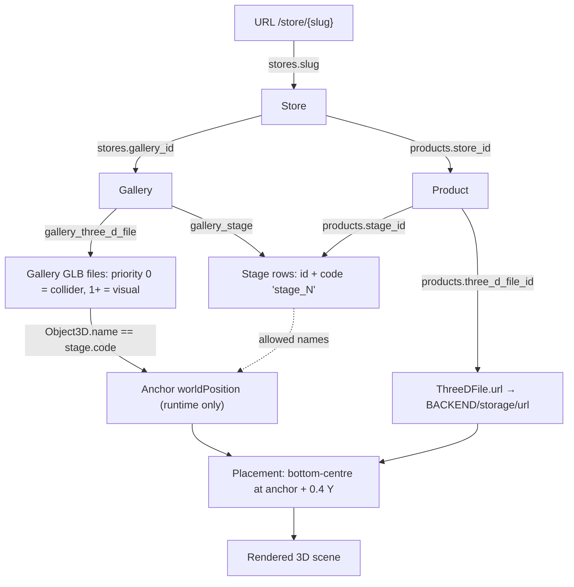
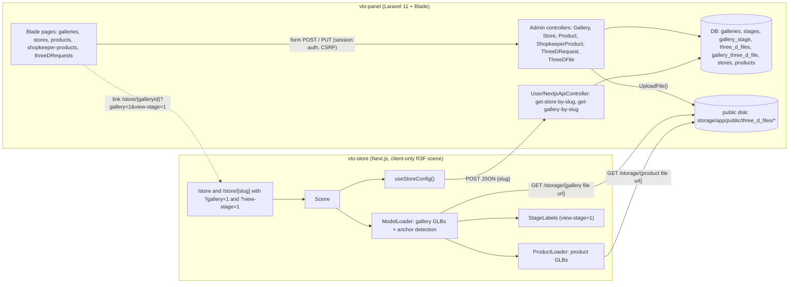
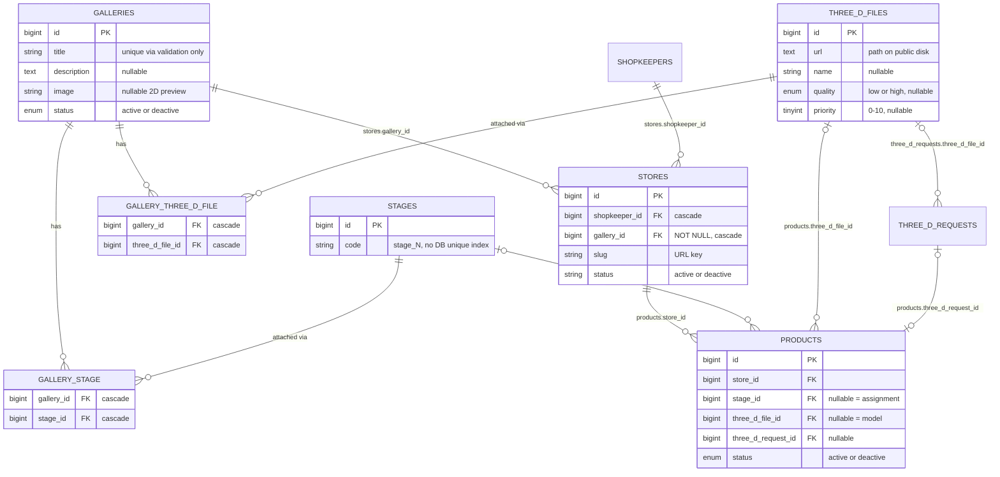
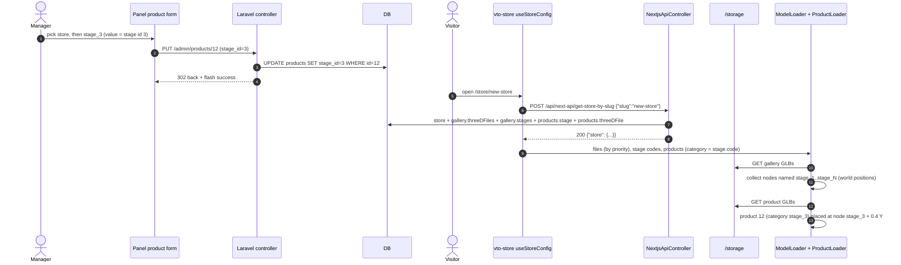

# Gallery Store & Product Placement System

> Reverse-engineered from two repositories. Documentation only — no application code was changed.
>
> | Repo | Role | Stack | Commit analysed |
> |---|---|---|---|
> | `vto-store` | Public 3D store viewer | Next.js 14.2.18 (app router), React 18, three 0.161, @react-three/fiber 8, drei 9, rapier | `7bf1268` |
> | `vto-panel` | Admin / shopkeeper panel, public JSON API, DB, file storage | Laravel 11, Blade + jQuery, SQLite (per `.env.example`) | `6d03485` |
>
> **Evidence tags**
> - **[C] Confirmed** — read directly in the code.
> - **[I] Inferred** — derived from several pieces of code and/or standard framework behaviour; not observed at runtime.
> - **[?] Not confirmed from the current codebase.**

**Reading guide (A–G split requested)**

| Part | Where |
|---|---|
| A. Business logic | §2, §17 |
| B. Current implementation | §6–§11, §19 |
| C. Data model | §4, §5 |
| D. API contract | §15, §16 |
| E. Frontend behaviour | §9, §10, §13 |
| F. Admin behaviour | §11, §14 |
| G. Migration guidance | §20, §21 |

---

## Critical Implementation Details (read first)

1. **The product ↔ location join key is the stage `code` string** (e.g. `stage_3`). The 3D app matches `product.stage.code` against the `Object3D.name` of nodes inside the gallery GLB. Stage IDs are never used by the 3D app. [C]
2. **Location positions are not stored in the database.** They exist only inside the gallery's GLB file as named nodes; the 3D app reads each node's world position at runtime. [C]
3. **Stages are global rows** (`stages.id`, `stages.code`, seeded `stage_1`…`stage_10`) attached to galleries through the `gallery_stage` pivot. The same code means a *different physical spot* in every gallery GLB. [C]
4. **The assignment is a direct, nullable FK on the product: `products.stage_id`.** No pivot, no assignment table. One product → at most one stage. Nothing prevents several products sharing a stage (they render on top of each other). [C]
5. **Ownership chain is Store → Gallery, not Gallery → Store.** `stores.gallery_id` points to a shared gallery template; many stores can use one gallery. Products belong to stores (`products.store_id`); there is no product ↔ gallery FK. [C]
6. **`view-stage=1` is only a boolean overlay flag.** It draws the stage number above every detected anchor. It does not select a stage, move the camera or change which products load. Only the exact string `1` enables it. [C]
7. **The number shown in 3D is `code` minus the `stage_` prefix** (`stage_3` → `3`), not the DB id. IDs and numbers coincide today only because of seeding order. [C]
8. **`gallery=1` switches to gallery mode**: the path segment is a gallery **id or exact title**, and the response always has `products: []`. The panel opens `/store/{galleryId}?gallery=1&view-stage=1` so managers can see numbered empty stages before choosing one. [C]
9. **Store mode (`/store/{store.slug}`) returns all products of the store** with `stage` and `three_d_file` — no `status` filter on product, store or gallery. [C]
10. **Frontend drops products without `stage.code` or without `three_d_file.url`**, and skips (with `console.warn`) products whose stage code has no matching node. [C]
11. **Anchor detection rules:** only codes attached to the gallery are searched; exact name match on *any* `Object3D`; max **15 anchors per GLB file**; names are what three.js `GLTFLoader` produces after sanitising (whitespace → `_`, `[ ] . : /` removed) and de-duplicating (`_1`, `_2` suffixes). [C]
12. **Placement formula:** the product's bounding box is centred on the anchor in X/Z and its bottom is placed at anchor Y **+ 0.4**. Anchor rotation and scale are ignored; the product GLB keeps its native scale. [C]
13. **Anchor positions are captured before the visual scene is re-based to Y = 0.** Placement is only correct if the gallery GLB's lowest point is at Y ≈ 0. [C] (effect: [I])
14. **Gallery file `priority = 0` is an invisible Rapier trimesh collider**; other files are visual. Files without priority get auto-numbered 1, 2, … . `quality` is carried but never used. [C]
15. **No server-side check that the chosen stage belongs to the product's store gallery** (`exists:stages,id` only). The UI filters the dropdown to gallery stages, except the 3D-request page which lists all stages. [C]
16. **Changes appear on the next page load only.** No polling, websockets or server cache. [C]
17. **The read API is public** (no auth, CORS `*`). Writes go through the session-authenticated Blade panel. [C]
18. **One bad product asset can break the whole scene:** the backend does not validate product file types (a `.png` was saved as a product "3D file" in a captured response) and the scene has no error boundary. [C] (crash effect: [I])

---

## 1. Overview

A **Gallery** is a reusable 3D showroom template: one or more GLB files plus a set of **Stages** (named anchor slots) available in that scene. A **Store** belongs to a shopkeeper and uses exactly one gallery. **Products** belong to a store; each product with a 3D model can be pinned to one stage. The 3D app loads the store, loads the gallery GLBs, finds nodes whose names equal the gallery's stage codes, and drops each product's GLB on the matching node.



---

## 2. Business Concept

### 2.1 What the system is supposed to do (A)

1. Admins prepare **galleries** (sidebar label "مدیریت گالری های پیشفرض" = *manage default galleries*): 3D scene files + the list of stages that exist in that scene.
2. Admins create a **store** for a shopkeeper user and pick the store's gallery.
3. **Products** are created for a store, either by an admin with a 3D file, or by the shopkeeper through a 3D-generation request (photos/videos → admin later uploads the finished model).
4. Each product that has a 3D model can be pinned to one stage of its store's gallery.
5. Visitors open the store in the 3D app, walk around, see each pinned product on its stage, click it for a popup (details + rotating 3D viewer).
6. Managers open the gallery preview with numbered labels to learn which stage number is where, then pick that stage in the panel.

### 2.2 Glossary

| Concept | Table / model | Persian UI label | Notes |
|---|---|---|---|
| Gallery | `galleries` / `Gallery` | گالری | Scene template shared by stores |
| Stage | `stages` / `Stage` | استیج | Global anchor slot identified by `code` |
| Store | `stores` / `Store` | فروشگاه | Owned by a shopkeeper; URL key = `slug` |
| Product | `products` / `Product` | محصول | Jewellery item; holds the assignment |
| 3D file | `three_d_files` / `ThreeDFile` | فایل سه بعدی | Used both for gallery scene parts and product models |
| 3D request | `three_d_requests` / `ThreeDRequest` | درخواست سه بعدی | Shopkeeper request to produce a product model |

### 2.3 Where the real implementation differs from the assumed flow

| Assumption | Actual behaviour |
|---|---|
| "Each gallery has its own store" | Reversed: `stores.gallery_id` → gallery. A gallery is a shared template; N stores may use it. No `Gallery::stores()` relation exists. [C] |
| "The store contains predefined locations" | Stages hang off the **gallery** (`gallery_stage`), not the store. Their coordinates live only in the gallery GLB. [C] |
| "Each location has a position/order number" | There is no numeric or order column. The number is embedded in the code string and extracted for display only. [C] |
| "`view-stage` identifies the viewed/selected stage" | It is a debug/overlay toggle (`=== '1'`) that shows numbers for all stages. [C] |
| "The user can select a location in the 3D app" | No stage selection exists in `vto-store`. Clicking selects a **product** (raycast → popup). Stage selection happens in panel dropdowns. [C] |
| "The manager assigns one of the gallery's products to a location" | Products belong to stores. The UI is product-centric: edit a product → choose its stage. There is no location-centric screen. [C] |
| "The 3D app loads the correct product at the location" | Yes — matched by `stage.code` ↔ node name. [C] |

---

## 3. Architecture



- The 3D app is a pure client: `app/store/[slug]/page.tsx` loads `components/store/Scene` with `dynamic(..., { ssr: false })`. [C]
- The only backend calls made by the 3D app are the two `next-api` POSTs plus static GETs under `/storage/`. [C]

---

## 4. Entity Relationships



### Real example (from the captured API response `vto-store/components/store/hooks/slug-res.json`)

```text
Store #1 "فروشگاه گلد وان"  slug=new-store  gallery_id=1
└── Gallery #1 "گالری اصلی"
     ├── Scene files (gallery_three_d_file)
     │    ├── ThreeDFile #2  three_d_files/Cg6o0Egd7Z.glb  priority 0  → invisible collider
     │    └── ThreeDFile #1  three_d_files/UtdSR8MoAy.glb  priority 1  → visual scene
     └── Stages (gallery_stage)
          ├── stage_1 (id 1) ── Product #1 "حلقه"    (3D file #3)
          │                  └─ Product #3 "گوشواره" (3D file #4)   ← two products share one stage
          ├── stage_2 (id 2) ── empty
          ├── stage_3 (id 3) ── empty
          └── stage_4 (id 4) ── empty
Unplaced: Product #2 "النگو"  stage_id=null  three_d_file_id=null  three_d_request_id=3  → dropped by the frontend
```

Note: in that capture products #1 and #3 point to `.png` files, which `GLTFLoader` cannot parse (see §18).

---

## 5. Data Model

Source: `vto-panel/database/migrations/*`, `vto-panel/app/Models/*`.

### 5.1 `galleries` — `2023_05_13_095316_create_galleries_table.php`, `2026_07_19_071600_add_image_to_galleries_table.php`

| Column | Type | Null | Notes |
|---|---|---|---|
| `id` | bigint PK | no | Used in gallery-mode URLs `/store/{id}?gallery=1` |
| `title` | string | no | Unique by validation (`unique:galleries,title`), not by DB index. Also accepted as lookup key in gallery mode |
| `description` | text | yes | |
| `image` | string | yes | 2D reference image (public disk `galleries/`), shown next to the stage dropdown in panel forms. What it depicts: [?] |
| `status` | enum `active`/`deactive` | no (default `active`) | Not checked by the API |

Relations: `Gallery::stages()` belongsToMany via `gallery_stage`; `Gallery::threeDFiles()` belongsToMany via `gallery_three_d_file`. Neither relation calls `withTimestamps()`, so pivot timestamps are not written by `sync()`. [C] / [I]

### 5.2 `stages` — `2023_07_13_102800_create_stages_table.php`

| Column | Type | Null | Notes |
|---|---|---|---|
| `id` | bigint PK | no | Value submitted by panel forms as `stage_id` |
| `code` | string | no | Column comment: "product stage code on 3d scene which starts with stage_". **No unique index.** Must equal the GLB node name |

- Seeded by `database/seeders/StageSeeder.php`: `stage_1` … `stage_10` (so id *n* ↔ `stage_n` on a fresh DB). [C]
- There is **no CRUD UI or route** for stages. [C]
- Relations: `Stage::galleries()` (belongsToMany), `Stage::products()` (hasMany). [C]

### 5.3 `gallery_stage` (pivot) — `2026_07_13_102958_create_gallery_stage_table.php`

`id`, `gallery_id` (FK, cascade), `stage_id` (FK, cascade), timestamps, **unique(`gallery_id`, `stage_id`)**. [C]

### 5.4 `three_d_files` — `2023_07_13_094703_create_three_d_files_table.php`

| Column | Type | Null | Notes |
|---|---|---|---|
| `id` | bigint PK | no | |
| `url` | text | no | Relative path on the `public` disk, e.g. `three_d_files/UtdSR8MoAy.glb`. Public URL = `{BACKEND}/storage/{url}` |
| `name` | string | yes | Display name; defaults to original filename |
| `quality` | enum `low`/`high` | yes | Only meaningful for gallery files; unused by the renderer |
| `priority` | tinyint (0–10) | yes | Gallery files: `0` = collider wireframe, `1+` = visual; load order ascending |

### 5.5 `gallery_three_d_file` (pivot) — `2026_07_13_095836_create_gallery_three_d_file_table.php`

`id`, `gallery_id` (FK, cascade), `three_d_file_id` (FK, cascade), timestamps, **unique(`gallery_id`, `three_d_file_id`)**. [C]

### 5.6 `stores` — `2024_06_08_094318_create_stores_table.php`

| Column | Type | Null | Notes |
|---|---|---|---|
| `id` | bigint PK | no | |
| `shopkeeper_id` | FK → shopkeepers | no | cascade |
| `gallery_id` | FK → galleries | **no (DB)** | cascade. Validation says `nullable`, model docblock says `int|null` — mismatch |
| `slug` | string | no | 3D-app URL key. Unique by validation + `generateSlug()`; no DB unique index |
| `status` | string | no | `active` / `deactive`; not checked by the API |
| `title`, `logo`, `description`, `view_count`, `is_pending_update`, timestamps | | | Not used by placement |

`Store::booted()` → on Eloquent `deleting`: deletes the store's products and files and deactivates the shopkeeper and user. [C]

### 5.7 `products` — `2024_06_08_094319_create_products_table.php`, `2026_07_19_055059_add_three_d_request_id_to_products_table.php`

| Column | Type | Null | Notes |
|---|---|---|---|
| `id` | bigint PK | no | Stored in each product mesh as `userData.productId` for click picking |
| `store_id` | FK → stores | no | No `onDelete` rule |
| `stage_id` | FK → stages | **yes** (since 2026-07-19) | **The assignment.** No unique constraint |
| `three_d_file_id` | FK → three_d_files | **yes** (since 2026-07-19) | The product's 3D model |
| `three_d_request_id` | FK → three_d_requests | yes | `nullOnDelete`; shopkeeper flow |
| `status` | enum `active`/`deactive` | no | **Not filtered** anywhere in the placement path |
| `title`, `weight`, `caliber`, `construction_fee`, `description` | | | Shown in popup (see §10.4) |
| `sales_count`, `view_count`, timestamps | | | Unused by placement |

No `SoftDeletes` on `Product` → deletion is a hard delete. [C]

### 5.8 `three_d_requests` / `three_d_request_files`

`three_d_requests`: `shopkeeper_id`, `note`, `status` (`new`/`pending`/`done`/`rejected`), `three_d_file_id` (finished model). `three_d_request_files`: uploaded photos/videos. `ThreeDRequest::product()` = hasOne `Product` by `three_d_request_id`. [C]

### 5.9 Frontend structures (vto-store)

| Type | File | Shape | Origin |
|---|---|---|---|
| `StoreConfig` | `components/store/hooks/useStoreConfig.ts` | `{ id: store.slug, files: ModelFile[] }` | `transformAPIToStoreConfig()` |
| `ModelFile` | same | `{ url: BACKEND/storage/{url}, priority: file.priority ?? auto(1,2,…), quality: file.quality ?? 'high' }` | same |
| `ProductData` | `components/store/ProductInteraction.tsx` | `{ id, category, variant, price, weight, name_fa, glbPath }` | `transformAPIToProducts()` — `category` **= `stage.code`** |
| `stages` | hook return | `string[]` of `gallery.stages[].code` | `extractStages()` |
| `StagePosition` | `types/api.ts` | `{ name, position, worldPosition, rotation, scale }` (each `{x,y,z}`) | `ModelLoader` traversal |
| API types | `types/api.ts` | `APIStore`, `APIGallery`, `APIStage`, `APIProduct`, `APIThreeDFile`, `GetStoreBySlugResponse` | Typed as non-null `stage`/`three_d_file`, but the API can return `null` (handled by the filter) |

### 5.10 Assignment state matrix

| `stage_id` | `three_d_file_id` | Stage code attached to gallery **and** node exists in GLB | Rendered? |
|---|---|---|---|
| null | null | — | No (filtered) — fresh shopkeeper product awaiting its model |
| null | set | — | No (filtered) — "unplaced" |
| set | null | — | No (filtered) |
| set | set | No | No — `console.warn` in `ProductLoader` |
| set | set | Yes | **Yes** |

---

## 6. Gallery → Store Relationship

- **Link:** `stores.gallery_id` → `galleries.id` (`Store::gallery()` belongsTo). [C]
- **Cardinality:** many stores → one gallery. [C]
- **Where set:** `vto-panel/app/Http/Controllers/Admin/StoreController.php` `store()` and `update()` (field `gallery_id`, rule `nullable|exists:galleries,id`), from the store create/edit modals (`resources/views/admin/stores/index.blade.php`, `show.blade.php`). [C]
- **Null gallery:** validation allows it, the column is NOT NULL → the insert/update would fail and surface as the generic error flash. [I]
- **Changing a store's gallery:** products keep their `stage_id`. They reappear on the node with the same code in the new gallery GLB, or silently disappear if the new gallery lacks that code. No code handles this transition. [C]
- **Deleting a gallery** (`GalleryController::destroy`): DB cascade targets stores (Eloquent `Store::deleting` does **not** run for DB cascades). If a store has products, `products.store_id` (no cascade) blocks the delete → error flash. [I] (depends on FK enforcement; `config/database.php` enables it for SQLite by default)
- **Status:** neither `galleries.status` nor `stores.status` is checked when serving the 3D scene. [C]
- **How the 3D app gets the gallery:**
  - store mode → nested `store.gallery` from `get-store-by-slug`; [C]
  - gallery mode → URL segment treated as gallery `id` **or** exact `title` (`Gallery::where('id', $slug)->orWhere('title', $slug)`). [C]
- **Store identification:** `stores.slug`. `StoreController::generateSlug()` transliterates Persian → Latin, runs `Str::slug`, and appends `-1`, `-2`… for uniqueness. On update the slug is regenerated only if the submitted slug is empty and the title changed (the edit form pre-fills the current slug). [C]

---

## 7. Store Locations / Stages

### 7.1 Defining stages

1. Stage rows exist globally (seeded `stage_1`…`stage_10`; no UI to add more). [C]
2. An admin attaches a subset to a gallery in `admin/galleries` create/edit modals: multi-select `stages[]` listing **all** stages by `code`; saved with `$gallery->stages()->sync(...)` (`GalleryController::store()` / `update()`; update syncs `[]` when nothing is sent). [C]
3. A 3D artist must name anchor nodes in the gallery GLB exactly like those codes. **Nothing in either repo validates this.** [C]

### 7.2 Runtime anchor detection — `vto-store/components/store/ModelLoader.tsx`

```text
stages = gallery.stages.map(s => s.code)                      // useStoreConfig.extractStages()
for each gallery file, sorted by priority ascending:           // ModelLoader.sortedFiles
    gltf  = useLoader(GLTFLoader + DRACO '/draco/', url)       // Model()
    clone = gltf.scene.clone(true)
    found = []
    clone.traverse(obj):
        if found.length < 15 and obj.name in stages:           // any Object3D, exact match
            found.push({ name: obj.name,
                         position: obj.position,               // local
                         worldPosition: obj.getWorldPosition(),// relative to un-shifted clone root
                         rotation, scale })                    // captured, never used for placement
        (material tweaks, collider transparency, etc.)
    if file is visual (priority != 0):
        clone.position.y = -Box3(clone).min.y                  // re-base AFTER anchors were captured
    report found → allStagesRef.push(...found)
when loadedCount >= files.length and > 0:
    onStagesDetected(allStagesRef.current); onModelsLoaded()   // Scene.setStagePositions / phase 'transitioning'
```

Key consequences:

| Rule | Status |
|---|---|
| Only codes attached to the gallery are searched (`allowedStages`) | [C] |
| Matching is exact, case-sensitive, on `Object3D.name` of any node type (empty, group or mesh) | [C] |
| three.js r161 `GLTFLoader.createUniqueName()` sanitises names (`PropertyBinding.sanitizeNodeName`: whitespace → `_`, removes `[ ] . : /`) and de-duplicates (`name_1`, `name_2`, …) — e.g. a Blender object `stage_1.001` loads as `stage_1001` | [C] (three source); authoring impact [I] |
| Max 15 anchors collected **per GLB file** (`stages.length < 15`) | [C] |
| Every gallery file is scanned, including the priority-0 collider; if two files contain the same anchor name, both are collected and the last one wins in `ProductLoader`'s map, and duplicate labels render | [C] / [I] |
| Anchor Y is captured before the visual model is shifted up by `-box.min.y`; if the scene's lowest point is not at Y = 0, products and labels are offset by that amount | [C] / [I] |
| Anchor rotation/scale are ignored | [C] |
| Gallery with no stages → `new Set([])` → no anchors → no products, no labels | [C] |

### 7.3 Numbering

- `components/store/StageLabels.tsx`: `stageNumber = stage.name.replace(/^stage_/, '')` → drei `<Billboard>` + `<Text>` (gold, size 0.6) at `worldPosition.y + 0.8`. [C]
- A code without the `stage_` prefix is shown verbatim. [C]
- The panel dropdowns show the full code (`stage_3`); value is the stage id. The manager must map "3" in 3D ↔ "stage_3" in the dropdown. [C]

### 7.4 Ordering

No order/sort column exists; `gallery.stages` order is whatever the DB returns. Order has no effect on placement or labels. [C]

---

## 8. Product Assignment Logic

### 8.1 Where the assignment lives

`products.stage_id` (nullable FK → `stages.id`). The 3D app reads it indirectly as `product.stage.code`. [C]

### 8.2 All write paths

| # | UI entry point | HTTP route (web, `auth`) | Controller method | `stage_id` rule | Preconditions / side-effects | Can unassign? |
|---|---|---|---|---|---|---|
| 1 | Admin "Add product" page | `POST /admin/products` | `Admin\ProductController@store` | `required`, `exists:stages,id` | `3d_file` required → new `ThreeDFile` row → `three_d_file_id`. Shopkeeper must own `store_id` | n/a |
| 2 | Admin "Edit product" page | `PUT /admin/products/{product}` | `Admin\ProductController@update` | `required`, `exists:stages,id` | Optional new `3d_file` → **new** `ThreeDFile` row (old row/file kept) | **No** |
| 3 | Shopkeeper product list → layer icon → "تخصیص استیج" modal | `POST /admin/shopkeeper-products/{product}/assign-stage` | `Admin\ShopkeeperProductController@assignStage` | `required`, `exists:stages,id` | Product must have `three_d_file_id`; shopkeeper must own the store; `Gate::authorize('access_products')` | **No** |
| 4 | Shopkeeper "Edit product" page | `PUT /admin/shopkeeper-products/{shopkeeper_product}` | `Admin\ShopkeeperProductController@update` | `nullable`, `exists:stages,id` | Applied only if the product already has `three_d_file_id` **and** the request contains `stage_id` | **Yes** — choosing the empty option sends `""` → `null` (Laravel `ConvertEmptyStringsToNull`) [I] |
| 5 | 3D request detail → "مدیریت سریع" (role `admin` only) | `PUT /admin/threeDRequests/{threeDRequest}` | `Admin\ThreeDRequestController@update` | `nullable`, `exists:stages,id` | Only when `finished_file` is uploaded: creates `ThreeDFile`, sets request `status=done`, sets linked product's `three_d_file_id` and, if `stage_id` truthy, `stage_id`. Dropdown lists **all** stages (`Stage::all()`) | No |

Other ways the assignment disappears: deleting the product (hard delete), or deleting the store (Eloquent hook deletes its products). [C]

### 8.3 How the location is identified in the panel

By `stages.id`. In paths 1, 2 and 4 the `<option>` of each store carries `data-gallery-id`, `data-stage-ids` (JSON array of ids) and `data-stage-names` (JSON map id → code) built from `$store->gallery->stages`. jQuery rebuilds `#stage_id` on store change (`value = id`, label = `code`). Path 3 renders the options server-side from `$product->store->gallery->stages`. Path 5 lists every stage. [C]

### 8.4 How the product is selected

Implicitly: every write path is a form **of one product**. There is no screen that starts from a location and picks a product. [C]

### 8.5 What the server does NOT validate

| Missing check | Consequence |
|---|---|
| Stage belongs to the store's gallery | Possible via path 5 or crafted requests; product never renders (no matching anchor) [C] |
| One product per stage | Overlapping models at the same anchor [C] |
| Product file is GLB/glTF (`3d_file`, `finished_file` accept any file ≤ 50 MB) | Unloadable asset breaks the scene (§18) [C] |
| Product `status = active` | Deactivated products still render [C] |

### 8.6 Read path

`NextjsApiController::get_store_by_slug()` eager-loads `products.stage` and `products.threeDFile` → JSON `products[].stage.code`, `products[].three_d_file.url`. [C]

---

## 9. `view-stage` Query Parameter

| Question | Answer |
|---|---|
| Where is it read? | `vto-store/components/store/Scene.tsx:80` — `const viewStage = searchParams.get('view-stage') === '1'` [C] |
| Where is it created? | Only in `vto-panel` Blade links (table below). `vto-store` never writes it. [C] |
| Exact value meaning | Boolean flag. Only the string `1` is truthy; `true`, `yes`, `2`, empty or missing → off. **Not** a stage id, number, index or slug. [C] |
| Effect on scene initialisation | None on data loading. It only gates `{viewStage && stagePositions.length > 0 && <StageLabels stages={stagePositions} />}` (`Scene.tsx:221`). [C] |
| Effect on camera | None. Camera spawn and fly-in are hard-coded (`CameraTransition` target `[0, 2.5, 5]`, start `[0, 9.5, 45]`; player body at `[0, 1.6, 5]`). [C] |
| Changes the selected location? | No — there is no "selected location" state in `vto-store`. [C] |
| Changes which product loads? | No. Products depend only on the API response. [C] |
| Visual-only or product-selection logic? | Visual only (labels for every detected anchor, assigned or not). [C] |
| Missing parameter | No labels; everything else identical. [C] |
| Invalid value | Same as missing. [C] |
| Persisted / changed during navigation? | Not persisted, never modified by the app. It is part of `useSearchParams()`, which is a dependency of `useStoreConfig`'s effect, so a client-side URL change would refetch; no such navigation exists. [C] |
| Works in both modes? | Yes — independent of `gallery=1`. Labels appear as soon as anchors are detected (before the camera transition ends). [C] |

**Where the panel generates it**

| File (vto-panel) | Line | Generated URL |
|---|---|---|
| `resources/views/admin/products/create.blade.php` | 170 | `${NEXT_PUBLIC_STORE_URL}/store/${galleryId}?gallery=1&view-stage=1` (JS, on store change) |
| `resources/views/admin/products/edit.blade.php` | 7, 184 | same (server-rendered, then JS) |
| `resources/views/admin/stores/index.blade.php` | 137 | `/store/{store.gallery.id}?gallery=1&view-stage=1` |
| `resources/views/admin/products/index.blade.php` | 61 | `${NEXT_PUBLIC_PRODUCT_URL}/product/{gallery.id}?gallery=1&view-stage=1` — `vto-store` has **no** `/product/*` route [C]; target [?] |
| `resources/views/admin/shopkeeper-products/index.blade.php` | 61 | same `/product/...` link |
| `resources/views/admin/galleries/index.blade.php:164`, `galleries/show.blade.php:90` | — | `/store/{gallery.id}?gallery=1` (no `view-stage`) |

`NEXT_PUBLIC_STORE_URL` / `NEXT_PUBLIC_PRODUCT_URL` are read with `env()` directly in Blade, defaulting to `http://localhost:3000`. [C]

**Examples**

| URL | Result |
|---|---|
| `/store/1?gallery=1&view-stage=1` | Gallery #1, no products, labels `1`, `2`, `3`, `4` above nodes `stage_1`…`stage_4` |
| `/store/new-store?view-stage=1` | Store with its products **and** labels — the best way to verify an assignment (not linked from the panel) |
| `/store/new-store` | Normal visitor view, no labels |
| `/store/new-store?view-stage=true` | No labels |

---

## 10. vto-store Implementation

### 10.1 Routes

| Route | File | Behaviour |
|---|---|---|
| `/store` | `app/store/page.tsx` (`StorePage`) | No slug → `NEXT_PUBLIC_DEFAULT_STORE_SLUG`. Linked from `components/layout/Navigation.tsx` and `HeroSection` |
| `/store/[slug]` | `app/store/[slug]/page.tsx` (`StoreSlugPage`) | Store slug, or gallery id/title with `?gallery=1` |
| Query `gallery=1` | `useStoreConfig.ts:72` (`== '1'`) | Selects `get-gallery-by-slug` |
| Query `view-stage=1` | `Scene.tsx:80` (`=== '1'`) | Stage labels |

Both pages: `'use client'` + `dynamic(() => import('@/components/store/Scene'), { ssr: false })`. [C]

### 10.2 Configuration

| Env var | Used in | Purpose |
|---|---|---|
| `NEXT_PUBLIC_BACKEND_API_URL` | `useStoreConfig.ts` | API base **and** asset base (`{base}/storage/{url}`) |
| `NEXT_PUBLIC_DEFAULT_STORE_SLUG` | `useStoreConfig.ts:69` | Fallback slug for `/store` |

`NEXT_PUBLIC_*` values are inlined at build time (Next.js behaviour). [I] DRACO decoder files are served from `vto-store/public/draco/`. [C]

### 10.3 Module map

```text
vto-store/
├── app/store/page.tsx, app/store/[slug]/page.tsx     → client-only <Scene/>
├── components/store/
│   ├── Scene.tsx                 Scene(): orchestrates phases, reads view-stage, mounts loaders
│   ├── hooks/useStoreConfig.ts   useStoreConfig(), transformAPIToStoreConfig(), transformAPIToProducts(), extractStages()
│   ├── ModelLoader.tsx           ModelLoader(), Model(): gallery GLBs, collider, anchor detection, re-base
│   ├── ProductLoader.tsx         ProductLoader(), ProductModel(): stage map, product placement, userData.productId
│   ├── StageLabels.tsx           StageLabels(): number billboards
│   ├── ProductInteraction.tsx    ProductData type; click raycast → productId → product
│   ├── ProductPopup.tsx          popup: name, "price", weight, ProductViewer3D, VTO link
│   ├── ProductViewer3D.tsx       isolated orbit viewer of the product GLB
│   ├── CameraTransition.tsx, SceneTransition.tsx, ParticleReveal.tsx   intro effects
│   └── PlayerController.tsx, POVCamera.tsx, Joystick.tsx, PhysicsSystem.tsx  first-person movement
└── types/api.ts                  API response types + StagePosition
```

### 10.4 Data transformation (`useStoreConfig.ts`)

| Output | Rule |
|---|---|
| `config.files[i].url` | `${NEXT_PUBLIC_BACKEND_API_URL}/storage/${gallery.three_d_files[i].url}` |
| `config.files[i].priority` | `file.priority ?? autoPriority++` (starts at 1) |
| `config.files[i].quality` | `file.quality ?? 'high'` (unused later) |
| `products` | `store.products.filter(p => p.stage?.code && p.three_d_file?.url)` |
| `ProductData.id` | `product.id` |
| `ProductData.category` | **`product.stage.code`** (the placement key) |
| `ProductData.variant`, `name_fa` | `product.title` |
| `ProductData.price` | `product.construction_fee.toString()` — shown as "قیمت … تومان" although it is a percentage field |
| `ProductData.weight` | `product.weight.toString()` |
| `ProductData.glbPath` | `${base}/storage/${product.three_d_file.url}` |
| `stages` | `store.gallery.stages.map(s => s.code)` |

Side effect of `category = stage.code`: the popup's try-on link becomes `/vto/stage_1?model=<title>`, which `app/vto/[category]/route.ts` rejects (`VALID_CATEGORIES` = earrings, necklace, rings, watch, glasses → 404). [C]

### 10.5 Rendering pipeline and loading order

| Phase | Trigger | What renders |
|---|---|---|
| fetch | `useStoreConfig` `loading === true` | `<LoadingScreen/>` |
| `'loading'` | config ready | `<Canvas>` + `<ModelLoader>` (one `Suspense`) + `ModelsLoadingIndicator` (`loadedCount / config.files.length`) |
| anchors ready | `loadedCount >= files.length && > 0` | `setStagePositions(allStages)` → `<ProductLoader>` mounts in its own `Suspense`; `<StageLabels>` if `view-stage=1` |
| `'transitioning'` | `onModelsLoaded` | 4 s fog fade, 3.4 s camera fly-in, particles |
| `'ready'` | `SceneTransition.onComplete` | Physics player, joystick, gyro toggle, `ProductInteraction` (click → popup) |

- All gallery files share one `Suspense` boundary, so they appear together; products likewise appear together once all product GLBs resolve. [I] (React Suspense semantics)
- Products start loading only after **all** gallery files have loaded. [C]
- `useLoader` caches parsed GLTFs per URL for the session; each product clones the cached scene. [C]

### 10.6 Product placement (`ProductLoader.tsx`)

```text
stageMap = Map(stagePositions.name → StagePosition)            // last duplicate wins
for product in products:
    stage = stageMap.get(product.category)                     // category == stage.code
    if !stage: console.warn(...); skip
    clone = gltf(product.glbPath).scene.clone(true)
    box   = Box3(clone); c = box.center
    clone.position = ( stage.worldPosition.x - c.x,
                       stage.worldPosition.y - box.min.y + 0.4,
                       stage.worldPosition.z - c.z )
    every mesh: castShadow, receiveShadow, envMapIntensity = 1, userData.productId = product.id
```

Products are not physics bodies; the player can walk through them. [C]

### 10.7 Interaction

`ProductInteraction.tsx` raycasts on canvas `click`, ignores objects whose name contains `vitrin`, walks up parents until `userData.productId`, finds the `ProductData` by id and opens `ProductPopup`. [C]

### 10.8 Fallbacks and errors

| Condition | Behaviour |
|---|---|
| HTTP status not OK | Error screen "Store not found" / "Gallery not found" [C] |
| `/store` without `NEXT_PUBLIC_DEFAULT_STORE_SLUG` | Posts `{ "slug": null }` → backend validation fails → error screen; exact message depends on how Laravel renders the validation failure [?] |
| Gallery with zero files | `loadedCount` never exceeds 0 → phase stays `'loading'`, indicator stays, no products [C] |
| No priority-0 file | No collider; nothing stops the player from falling (the body is teleported back when `y < -5`) [C] |
| Asset 404 / not a glTF | `useLoader` throws; there is no error boundary and no `error.tsx` in `app/` → scene crashes [I] |

### 10.9 Legacy / stale material (do not copy)

- `public/config/stores.json` — not referenced by any code. [C]
- `public/config/products.json` — used only by `app/vto/[category]/route.ts`, not by the store scene. [C]
- `arch-docs/PRODUCT_CLICK_SYSTEM.md` — describes the old name → `products.json` matching. [C]
- `api-structure.md` — shows camelCase `threeDFiles` / `threeDFile` and a `files` array; the real API returns `three_d_files` / `three_d_file` and no `files` key. [C]

---

## 11. vto-panel Implementation

### 11.1 Routes

Admin (web, prefix `admin`, name `admin.`, middleware `auth` + `saveVisit`) — `routes/web.php`:

| Route | Controller | Line |
|---|---|---|
| `Route::resource('galleries', GalleryController)` except create/edit | `Admin\GalleryController` | 163 |
| `Route::resource('stores', StoreController)` except create/edit | `Admin\StoreController` | 156 |
| `Route::resource('products', ProductController)` | `Admin\ProductController` | 172 |
| `Route::resource('shopkeeper-products', …)` only index/create/store/edit/update | `Admin\ShopkeeperProductController` | 180 |
| `POST shopkeeper-products/{product}/assign-stage` → `admin.shopkeeper-products.assign-stage` | `ShopkeeperProductController@assignStage` | 181 |
| `Route::resource('threeDRequests', …)` except create/edit | `Admin\ThreeDRequestController` | 233 |
| `Route::resource('threeDFiles', …)` except create/edit | `Admin\ThreeDFileController` | 234 |

Public API — `routes/api.php:146-154`, prefix `/api/next-api`, **no auth middleware**:

| Route | Method | Used by vto-store |
|---|---|---|
| `/get-store-by-slug` | `get_store_by_slug` | **Yes** |
| `/get-gallery-by-slug` | `get_gallery_by_slug` | **Yes** |
| `/get-product-by-store` | `get_product_by_store` | No |
| `/get-store-contents`, `/get-store-file`, `/get-product-contents` | legacy | No |

CORS: `config/cors.php` paths `*`, origins `*`; `HandleCors` prepended to `web` and `api` groups (`bootstrap/app.php`); catch-all `OPTIONS /api/{any}` returns 200. [C]

### 11.2 Controllers (relevant methods)

| Controller | Method | What it does for this feature |
|---|---|---|
| `Admin\GalleryController` | `index` | Lists galleries + **all** stages + all 3D files for modals |
| | `store` / `update` | Validates `stages.*` / `three_d_files.*` exist; `sync()` pivots in a transaction; image upload to `galleries/` |
| | `show` | Gallery detail with stages and files |
| | `destroy` | Deletes image + gallery |
| `Admin\ThreeDFileController` | `store` / `update` | Upload scene/product files (`extensions:glb,gltf,obj,fbx,dae,stl,ply,3ds,usdz,hdr,exr`, `quality`, `priority` 0–10). Update with a new file deletes the old file and changes `url` (same id) |
| | `destroy` | Refuses when attached to a gallery; does not check products; deletes the disk file before the DB row |
| `Admin\StoreController` | `store` / `update` | Store + `gallery_id` + slug; `store` also upgrades the user to shopkeeper with shopkeeper permissions |
| | `show` / `index` | Shopkeepers see only their stores (`ShopkeeperScope`) |
| `Admin\ProductController` | `create` / `edit` | Loads stores `with('gallery.stages')` for the stage dropdown |
| | `store` / `update` | Write paths 1 and 2 (§8.2) |
| | `destroy` | Hard delete |
| `Admin\ShopkeeperProductController` | `store` | Product without stage/3D file + `ThreeDRequest` + media files |
| | `edit` / `update` | Write path 4 |
| | `index` | Products with `three_d_request_id`, plus per-product assign-stage modals |
| | `assignStage` | Write path 3 |
| `Admin\ThreeDRequestController` | `show` / `update` | Write path 5 |
| `User\NextjsApiController` | `get_store_by_slug`, `get_gallery_by_slug` | Public read API (§15) |

### 11.3 Views and client behaviour

| View | Role in the flow |
|---|---|
| `admin/galleries/index.blade.php`, `show.blade.php` | Create/edit gallery: title, description, image, `stages[]`, `three_d_files[]`, status; "view in 3D" link (`?gallery=1`) |
| `admin/stores/index.blade.php`, `show.blade.php` | Store CRUD with gallery select; gallery link with `view-stage=1`; product list of the store |
| `admin/products/create.blade.php`, `edit.blade.php` | Store select → dynamic stage select + "مشاهده گالری در 3D" button + gallery image preview |
| `admin/shopkeeper-products/index.blade.php` | Assign-stage modal per product (shown only if `three_d_file_id` and store gallery exist) |
| `admin/shopkeeper-products/edit.blade.php` | Optional stage select (only when the product has a 3D file) |
| `admin/threeDRequests/show.blade.php` | Admin quick-manage: status, finished file, optional stage (all stages) |
| `components/gallery-preview.blade.php` | `<x-gallery-preview>` thumbnail of `galleries.image` with enlarge modal |

### 11.4 Permissions

Gate closures in `app/Providers/AppServiceProvider.php` call `abort(403)` themselves, so even `Gate::allows()` enforces **when the gate is defined**. Undefined gates return `false` silently (no enforcement). [C]

| Action | Check in code | Effective restriction |
|---|---|---|
| Gallery list | `Gate::allows('access_stores_admin')` | `access_level.access_stores_admin` |
| Gallery show | `Gate::allows('access_stores')` | root, or shopkeeper/admin with the matching flag |
| Gallery create/update/delete | none | any authenticated panel user [C] |
| Store list/show | `access_stores` + shopkeeper scope/ownership | as above |
| Store create/update/delete | none | any authenticated panel user [C] |
| Admin product index/edit form | `Gate::allows('access_products')` | root / flags |
| Admin product create form, store, update, destroy | none (store/update check shopkeeper ownership) | any authenticated user; shopkeepers limited to own stores |
| Shopkeeper product index/edit/update/assignStage | `Gate::authorize('access_products')` + ownership | root / flags; shopkeepers own stores only |
| 3D request update | `access_three_d_requests_manage` (403 for shopkeepers); form shown only to role `admin` | admins |
| 3D file store/update/destroy | `Gate::allows('access_three_d_files_admin')` — **gate not defined** | no restriction [C] |

Sidebar: "مدیریت گالری های پیشفرض" shown when `access_stores_admin`; admins see `admin.products.index`, shopkeepers see `admin.shopkeeper-products.index`. [C]

### 11.5 File storage

`app/Traits/Upload.php::UploadFile()` stores on the `public` disk with a random 10-character name + original extension (`three_d_files/`, `galleries/`, `three_d_request_files/`, `images/stores/logos/`). Public URL is `{APP}/storage/{path}` via the `public/storage` symlink. Every upload gets a new name, so replaced assets get new URLs. [C] CORS headers for these static files depend on the web server: [?]

---

## 12. End-to-End Data Flow

### 12.1 Identifier at every step

| Step | Identifier | Type | Produced by | Consumed by |
|---|---|---|---|---|
| URL → Store | `stores.slug` | string | `StoreController::generateSlug()` / manual | `get_store_by_slug` (`where slug =`) |
| URL → Gallery (gallery mode) | `galleries.id` or exact `galleries.title` | int / string | Panel links use id | `get_gallery_by_slug` |
| Store → Gallery | `stores.gallery_id` | FK int | Store forms | eager load `gallery` |
| Gallery → Stages | `gallery_stage.(gallery_id, stage_id)` | pivot | Gallery forms `stages[]` | eager load `gallery.stages` |
| Gallery → Scene files | `gallery_three_d_file.(gallery_id, three_d_file_id)` | pivot | Gallery forms `three_d_files[]` | eager load `gallery.threeDFiles` |
| Stage → 3D anchor | `stages.code` = `Object3D.name` | string | Seeder + 3D artist | `ModelLoader` traversal |
| Store → Products | `products.store_id` | FK int | Product forms | eager load `products` |
| Product → Stage | `products.stage_id` → `stages.code` | FK int → string | Write paths §8.2 | `transformAPIToProducts` → `ProductData.category` |
| Product → 3D asset | `products.three_d_file_id` → `three_d_files.url` | FK int → path | Product upload / 3D request | `glbPath = {base}/storage/{url}` |
| Mesh → Product (click) | `userData.productId` = `products.id` | int | `ProductModel` | `ProductInteraction` |
| Display number | `stages.code` minus `stage_` | string | — | `StageLabels` |

### 12.2 Sequence



---

## 13. Frontend 3D Rendering Flow (typical visitor)

1. **URL:** `https://<store-host>/store/<store-slug>` (or `/store`, which uses `NEXT_PUBLIC_DEFAULT_STORE_SLUG`). [C]
2. **Gallery identification:** not in the URL; it comes from `store.gallery` in the response (`stores.gallery_id`). [C]
3. **Store identification:** path segment `slug` → `POST {BACKEND}/api/next-api/get-store-by-slug` with `{ "slug": "<store-slug>" }` → `Store::where('slug', …)`. [C]
4. **Locations retrieved:** codes from `store.gallery.stages[].code`; coordinates from the gallery GLBs at runtime (`ModelLoader`). [C]
5. **Location numbers:** derived from node names (`stage_7` → `7`) and only displayed with `view-stage=1`. [C]
6. **`view-stage`:** adds labels; no other effect. [C]
7. **Assigned products retrieved:** same response, `store.products[]` with `stage` and `three_d_file`, filtered client-side. [C]
8. **Product ↔ location match:** `Map(anchor.name → anchor).get(product.stage.code)`. [C]
9. **3D asset loaded:** `useLoader(GLTFLoader + DRACO, {BACKEND}/storage/{three_d_file.url})`, once per URL. [C]
10. **Positioning:** bottom-centre of the product's bounding box at anchor world position + 0.4 Y; no rotation/scale from the anchor. [C]
11. **Empty locations:** nothing rendered; label still shown with `view-stage=1`. [C]
12. **Manager changes the assignment:** only `products.stage_id` changes in the DB; no event is emitted. [C]
13. **Frontend reflects it:** on the next full page load (or remount). The fetch has no cache options, the API has no cache layer, product files keep their URLs unless re-uploaded. [C] Browser caching of the GET asset requests depends on server headers. [?]

---

## 14. Admin Assignment Flow

```text
Gallery ─(admin: galleries modal, stages[] + three_d_files[])─┐
Store ─(admin: stores modal, gallery_id)──────────────────────┤
Product ─(create/edit form or assign-stage modal)─────────────┤
   → choose store → stage list = store.gallery.stages (id → code)
   → optional: open /store/{galleryId}?gallery=1&view-stage=1 to see numbers
   → choose stage → submit form (stage_id)
   → Laravel validates, checks ownership → UPDATE products.stage_id
   → next visitor load of /store/{slug} → product on node == stage.code
```

1. **Gallery** (admin with `access_stores_admin`): upload scene GLBs in `admin/threeDFiles` (collider with `priority 0`, visual with `priority ≥ 1`), then create the gallery in `admin/galleries` selecting those files and the stage codes present in the GLB. [C]
2. **Store**: `admin/stores` → choose owner user, logo, gallery, slug (optional). [C]
3. **Product with model**:
   - Admin path: `admin/products/create` → store → stage (required) → 3D file (required) → save (path 1). [C]
   - Shopkeeper path: `admin/shopkeeper-products/create` → media files → product saved without stage/model and a `ThreeDRequest` is created; admin uploads the finished file in `admin/threeDRequests/{id}` (optionally with a stage, path 5); then the shopkeeper assigns the stage (path 3 or 4). [C]
4. **Location reference**: "مشاهده گالری در 3D" opens `/store/{galleryId}?gallery=1&view-stage=1` in a new tab: the empty gallery with numbers. The gallery image preview is also shown next to the form. [C]
5. **Select & save**: submit; controller validates (`exists:stages,id`), checks ownership for shopkeepers, updates `products.stage_id`, redirects back with a flash message. [C]
6. **Persistence**: single column update; no history, no event, no cache invalidation. [C]
7. **3D store**: the product appears at the node whose name equals the stage code on the next load of `/store/{slug}`. The panel does not link to this URL (only shows the slug). [C]

---

## 15. API Endpoints

### 15.1 `POST /api/next-api/get-store-by-slug` — store mode

| Item | Value |
|---|---|
| Caller | `vto-store/components/store/hooks/useStoreConfig.ts` → `useStoreConfig()` (when `gallery` ≠ `1`) |
| Handler | `vto-panel/app/Http/Controllers/User/NextjsApiController.php::get_store_by_slug()` |
| Auth | None. CORS `*` |
| Headers sent | `Content-Type: application/json` |
| Body | `{ "slug": string }` — `required|string` |
| Query | `Store::where('slug', slug)->with(['gallery.threeDFiles','gallery.stages','products.stage','products.threeDFile'])->first()` |
| 200 | `{ "store": Store }` with `gallery.three_d_files[]` (incl. `pivot`), `gallery.stages[]` (incl. `pivot`), `products[]` (each with `stage` or `null`, `three_d_file` or `null`). No `files` key |
| 404 | `{ "error": "Store not found" }` |
| Validation failure | Laravel validation response; JSON vs redirect not confirmed for this client [?] |
| Filtering | None (all products, any status; store/gallery status ignored) |

### 15.2 `POST /api/next-api/get-gallery-by-slug` — gallery mode

| Item | Value |
|---|---|
| Caller | `useStoreConfig()` when `?gallery=1` |
| Handler | `NextjsApiController::get_gallery_by_slug()` |
| Body | `{ "slug": string }` — gallery **id or exact title** |
| Query | `Gallery::where('id', slug)->orWhere('title', slug)->with(['threeDFiles','stages'])->first()` |
| 200 | Store-shaped wrapper: `id` = gallery id, `shopkeeper_id: null`, `gallery_id`, `status`, `title`, `slug` = gallery id, `logo: null`, `view_count: 0`, `description`, timestamps, `gallery: { id, title, description, status, created_at, updated_at, three_d_files, stages }`, **`products: []`** |
| 404 | `{ "error": "Gallery not found" }` |

### 15.3 `POST /api/next-api/get-product-by-store` — not used by vto-store

Body `{ store_slug, product_id }` or `{ store_slug, product_title }` → `{ product }` with `store`, `stage`, `three_d_file`; 404 `Store not found` / `Product not found in this store`; 422 `Either product_id or product_title is required`. [C]

### 15.4 Static assets — `GET {BACKEND}/storage/{three_d_files.url}`

Gallery scene files and product models, loaded by `ModelLoader` / `ProductLoader` / `ProductViewer3D`. DRACO-compressed glTF supported. [C]

### 15.5 Panel (session-auth Blade forms; responses are 302 redirects with `success` / `error` flash)

| Method + path | Handler | Fields relevant to placement |
|---|---|---|
| `POST /admin/galleries` | `GalleryController@store` | `title*` (unique), `description`, `image` (jpg/jpeg/png/gif ≤ 5 MB), `status*`, `stages[]` (ids), `three_d_files[]` (ids) |
| `PUT /admin/galleries/{gallery}` | `GalleryController@update` | same; missing arrays sync to `[]` |
| `DELETE /admin/galleries/{gallery}` | `GalleryController@destroy` | — |
| `POST /admin/threeDFiles` | `ThreeDFileController@store` | `file*`, `name`, `quality` (low/high), `priority` (0–10) |
| `PUT /admin/threeDFiles/{threeDFile}` | `ThreeDFileController@update` | `name*`, `file`, `quality`, `priority` |
| `POST /admin/stores` | `StoreController@store` | `title*`, `slug`, `user_id*`, `logo*`, `gallery_id`, `description`, `status*` |
| `PUT /admin/stores/{store}` | `StoreController@update` | `title*`, `slug`, `description`, `gallery_id`, `logo`, `status` (checkbox: present → active) |
| `POST /admin/products` | `ProductController@store` | `store_id*`, `stage_id*`, `3d_file*`, `title*`, `weight*`, `caliber*` (1–24), `construction_fee*` (0–100), `status*`, `description` |
| `PUT /admin/products/{product}` | `ProductController@update` | same, `3d_file` optional |
| `DELETE /admin/products/{product}` | `ProductController@destroy` | — |
| `POST /admin/shopkeeper-products` | `ShopkeeperProductController@store` | product fields + `media_files[]*` (images/videos ≤ 50 MB each) |
| `PUT /admin/shopkeeper-products/{shopkeeper_product}` | `ShopkeeperProductController@update` | product fields + `stage_id` (nullable) + `media_files[]` |
| `POST /admin/shopkeeper-products/{product}/assign-stage` | `ShopkeeperProductController@assignStage` | `stage_id*` |
| `PUT /admin/threeDRequests/{threeDRequest}` | `ThreeDRequestController@update` | `status*`, `note`, `finished_file`, `stage_id` |

`*` = required. All forms include `_token` (CSRF) and PUT forms use `_method=PUT`. Validation errors redirect back with the error bag. [I] (standard Laravel)

---

## 16. Request / Response Examples

### 16.1 Store mode (trimmed from the captured response `vto-store/get-store-by-slug-res.json`)

```http
POST /api/next-api/get-store-by-slug
Content-Type: application/json

{ "slug": "new-store" }
```

```json
{
  "store": {
    "id": 1, "shopkeeper_id": 1, "gallery_id": 1, "status": "active",
    "title": "new store", "slug": "new-store",
    "gallery": {
      "id": 1, "title": "first gallery", "status": "active",
      "three_d_files": [
        { "id": 4, "url": "three_d_files/mxviLsnA2k.glb", "quality": "high", "priority": 1,
          "pivot": { "gallery_id": 1, "three_d_file_id": 4 } },
        { "id": 5, "url": "three_d_files/jdEyT1Ph1m.glb", "quality": "low", "priority": 0,
          "pivot": { "gallery_id": 1, "three_d_file_id": 5 } }
      ],
      "stages": [
        { "id": 1, "code": "stage_1", "pivot": { "gallery_id": 1, "stage_id": 1 } },
        { "id": 2, "code": "stage_2", "pivot": { "gallery_id": 1, "stage_id": 2 } },
        { "id": 3, "code": "stage_3", "pivot": { "gallery_id": 1, "stage_id": 3 } },
        { "id": 4, "code": "stage_4", "pivot": { "gallery_id": 1, "stage_id": 4 } }
      ]
    },
    "products": [
      { "id": 1, "status": "active", "title": "first product", "weight": 2, "caliber": 24,
        "construction_fee": 3, "store_id": 1, "three_d_file_id": 6, "stage_id": 2,
        "stage": { "id": 2, "code": "stage_2" },
        "three_d_file": { "id": 6, "url": "three_d_files/1vYmGPuJOD.glb", "name": "blue-product",
                          "quality": null, "priority": null } },
      { "id": 2, "status": "active", "title": "second product", "weight": 2, "caliber": 24,
        "construction_fee": 3, "store_id": 1, "three_d_file_id": 7, "stage_id": 3,
        "stage": { "id": 3, "code": "stage_3" },
        "three_d_file": { "id": 7, "url": "three_d_files/SNrwP7GV7N.glb", "name": "red-product",
                          "quality": null, "priority": null } }
    ]
  }
}
```

(Timestamps and unused columns omitted. Products may also contain `three_d_request_id`, and `stage` / `three_d_file` may be `null` — see `components/store/hooks/slug-res.json`.)

**Derived by `useStoreConfig()`** (with `NEXT_PUBLIC_BACKEND_API_URL=https://api.example.com`):

```json
{
  "config": { "id": "new-store", "files": [
    { "url": "https://api.example.com/storage/three_d_files/mxviLsnA2k.glb", "priority": 1, "quality": "high" },
    { "url": "https://api.example.com/storage/three_d_files/jdEyT1Ph1m.glb", "priority": 0, "quality": "low" } ] },
  "stages": ["stage_1", "stage_2", "stage_3", "stage_4"],
  "products": [
    { "id": 1, "category": "stage_2", "variant": "first product", "name_fa": "first product",
      "price": "3", "weight": "2", "glbPath": "https://api.example.com/storage/three_d_files/1vYmGPuJOD.glb" },
    { "id": 2, "category": "stage_3", "variant": "second product", "name_fa": "second product",
      "price": "3", "weight": "2", "glbPath": "https://api.example.com/storage/three_d_files/SNrwP7GV7N.glb" }
  ]
}
```

**Detected anchor** (shape from `types/api.ts`, numbers illustrative):

```json
{ "name": "stage_2",
  "position": { "x": 1.2, "y": 0.9, "z": -3.0 },
  "worldPosition": { "x": 1.2, "y": 0.9, "z": -3.0 },
  "rotation": { "x": 0, "y": 0, "z": 0 },
  "scale": { "x": 1, "y": 1, "z": 1 } }
```

### 16.2 Gallery mode (shape built from `get_gallery_by_slug()`; values illustrative)

```http
POST /api/next-api/get-gallery-by-slug
Content-Type: application/json

{ "slug": "1" }
```

```json
{
  "store": {
    "id": 1, "shopkeeper_id": null, "gallery_id": 1, "status": "active",
    "title": "گالری اصلی", "slug": 1, "logo": null, "view_count": 0, "description": null,
    "created_at": "2026-07-18T10:20:31.000000Z", "updated_at": "2026-07-19T09:32:26.000000Z",
    "gallery": {
      "id": 1, "title": "گالری اصلی", "description": null, "status": "active",
      "created_at": "2026-07-18T10:20:31.000000Z", "updated_at": "2026-07-19T09:32:26.000000Z",
      "three_d_files": [ { "id": 1, "url": "three_d_files/UtdSR8MoAy.glb", "priority": 1, "quality": "high", "name": "فایل اصلی گالری", "pivot": { "gallery_id": 1, "three_d_file_id": 1 } } ],
      "stages": [ { "id": 1, "code": "stage_1", "pivot": { "gallery_id": 1, "stage_id": 1 } } ]
    },
    "products": []
  }
}
```

Errors: `404 {"error":"Store not found"}` / `404 {"error":"Gallery not found"}`.

### 16.3 Panel: assign a stage (shopkeeper list modal)

```http
POST /admin/shopkeeper-products/12/assign-stage
Content-Type: application/x-www-form-urlencoded
Cookie: <laravel session>

_token=<csrf>&stage_id=3
```

→ `302` back with flash `success` "استیج محصول با موفقیت تغییر یافت", or `error` "محصول فاقد فایل سه‌بعدی است" (no 3D file) / "شما مجاز به تغییر استیج این محصول نیستید" (not owner). Invalid `stage_id` → back with validation errors. [C]

### 16.4 Panel: admin product update (moves the product to another stage)

```http
POST /admin/products/12
Content-Type: multipart/form-data

_token=<csrf>&_method=PUT&title=Ring&store_id=1&stage_id=4&weight=3&caliber=18&construction_fee=3&status=active&description=
(3d_file optional)
```

→ `302` to `/admin/products` with flash `success`. [C]

### 16.5 Panel: attach stages to a gallery

```http
POST /admin/galleries/1
Content-Type: multipart/form-data

_token=<csrf>&_method=PUT&title=گالری اصلی&status=active&stages[]=1&stages[]=2&stages[]=3&stages[]=4&three_d_files[]=1&three_d_files[]=2
```

### 16.6 Panel: finish a 3D request and place the product

```http
POST /admin/threeDRequests/3
Content-Type: multipart/form-data

_token=<csrf>&_method=PUT&status=pending&note=...&stage_id=2&finished_file=<bangle.glb>
```

→ new `three_d_files` row; request `status` forced to `done`; product with `three_d_request_id = 3` gets `three_d_file_id` and `stage_id = 2`. [C]

---

## 17. Business Rules

| # | Rule | Status | Evidence |
|---|---|---|---|
| 1 | A product occupies at most one location | Enforced by schema | Single FK `products.stage_id` |
| 2 | A location may hold several products (they overlap) | Allowed, not handled | No unique index / validation; `ProductLoader` does not deduplicate |
| 3 | A product cannot appear in several locations | Enforced by schema | Single FK |
| 4 | A location can be empty | Yes | Nothing rendered; label shown with `view-stage=1` |
| 5 | Assignments can be removed | Only via shopkeeper edit (empty option), product delete or store delete | Admin forms and `assignStage` require `stage_id` |
| 6 | Stage codes are global; unique per gallery via pivot; not DB-unique globally | Partly enforced | `gallery_stage` unique pair; no index on `stages.code` |
| 7 | Stage numbers are meaningful only inside one gallery GLB | By design | Positions come from each gallery's file |
| 8 | Products belong to stores, not galleries; other stores on the same gallery do not see them | Enforced | `get_store_by_slug` loads `store.products` only |
| 9 | Stores belong to galleries; many stores per gallery | Enforced (NOT NULL FK) | Migration; validation inconsistently allows null |
| 10 | Assignment stored directly on the product (no pivot) | Yes | `products.stage_id` |
| 11 | Stage must belong to the store's gallery | **Not enforced** server-side; UI filters (except 3D request page) | `exists:stages,id` only |
| 12 | Only products with both stage and 3D file render | Enforced client-side | `transformAPIToProducts` filter |
| 13 | Product/store/gallery `status` affects visibility | **No** | No filter in API or client |
| 14 | Deleted products disappear; there are no soft deletes | Yes | Hard delete |
| 15 | Changing the store's gallery keeps assignments by code | Yes | No handling in `StoreController::update` |
| 16 | Removing a stage from a gallery leaves products assigned but invisible | Yes | `sync()` does not touch products; anchor not searched |
| 17 | Product data/model changes show on next load | Yes | No cache, no realtime |
| 18 | Location order matters | No | Unused |
| 19 | Default products / placeholders | None | Legacy `products.json` not used by the scene |
| 20 | Stage assignment requires an existing 3D file in the shopkeeper flow | Yes | `assignStage` / `update` guards; UI hides stage controls |
| 21 | Admin-created products must have stage and 3D file from the start | Yes | `required` rules |
| 22 | Read API is public; writes need panel session and (partially) gates | Yes | §11.4 |
| 23 | Scene rendering is client-only | Yes | `ssr: false` |
| 24 | Max 15 anchors per gallery GLB file | Yes | `stages.length < 15` |

---

## 18. Edge Cases

| Scenario | Behaviour | Tag |
|---|---|---|
| Unknown store slug | 404 → "Store not found" screen | [C] |
| Unknown gallery id/title in gallery mode | 404 → "Gallery not found" | [C] |
| A gallery titled like another gallery's id (e.g. title `"2"`) | `id = x OR title = x` → `first()` returns either | [I] |
| Gallery with no 3D files | Loading indicator forever | [C] |
| Gallery with files but no stages | Scene loads, no products, no labels | [C] |
| Stage attached but node missing in GLB | That stage never gets an anchor; products on it skipped with warning | [C] |
| Node present but stage not attached to gallery | Ignored (not in `allowedStages`) | [C] |
| Duplicate node names in one GLB | Loader renames duplicates `stage_1_1`; only the exact name matches | [C] (three source) |
| Same anchor in collider and visual file | Duplicate positions; last one wins for products; duplicate labels | [I] |
| More than 15 anchors in one file | Extra anchors ignored | [C] |
| Scene lowest point ≠ Y 0 | Products/labels vertically offset from the visual scene | [I] |
| Two products on one stage | Rendered overlapping; either can be clicked | [C] |
| Product whose stage is not in its gallery | Not rendered | [C] |
| Product model is not glTF (e.g. `.png`) or returns 404 | `useLoader` throws; no error boundary → whole scene fails | [I] |
| Deactivated product | Still rendered and clickable | [C] |
| Store deactivated / gallery deactivated | Still served | [C] |
| `ThreeDFile` replaced via `admin/threeDFiles` update | Same id, new `url` → new model on next load | [C] |
| `ThreeDFile` delete while a product uses it | Disk file deleted first; DB delete then fails on FK (if enforced) → product points to a missing file | [I] |
| Product moved to another store (admin edit) | Stage must be re-selected from the new store's gallery (`required`) | [C] |
| Shopkeeper edit to a store whose gallery has no stages | Stage select disabled → not submitted → old `stage_id` kept | [C] / [I] |
| `view-stage` with any value other than `1` | No labels | [C] |
| `/store` without default slug env | Backend validation failure → error screen | [C] / [?] message |
| Panel links `/product/{galleryId}` | No such route in `vto-store` | [C] (target [?]) |
| `php artisan config:cache` in production | `env()` in Blade returns null → links fall back to `http://localhost:3000` | [I] (Laravel behaviour) |
| Next.js dev Strict Mode | `useMemo` side effect in `Model()` may push anchors twice (duplicate labels in dev) | [I] |
| Popup "virtual try-on" button for API products | `/vto/stage_N?...` → 404 "Category not found" | [C] |

---

## 19. Important Files and Code References

### vto-store

```text
vto-store/
├── app/store/page.tsx                         StorePage → dynamic(Scene, { ssr:false })
├── app/store/[slug]/page.tsx                  StoreSlugPage → dynamic(Scene, { ssr:false })
├── components/store/Scene.tsx
│   ├── Scene()                               :77
│   ├── useStoreConfig() call                  :78
│   ├── viewStage = get('view-stage') === '1'  :80
│   ├── <ModelLoader allowedStages={stages} onStagesDetected={setStagePositions}>  :187
│   ├── <ProductLoader> when stagePositions.length > 0                            :197-199
│   ├── <ProductInteraction> when phase 'ready'                                   :218
│   └── <StageLabels> when viewStage && stagePositions.length > 0                 :221
├── components/store/hooks/useStoreConfig.ts
│   ├── transformAPIToStoreConfig()            :18   (/storage URLs, auto priority)
│   ├── transformAPIToProducts()               :37   (filter :41, category = stage.code, glbPath :49)
│   ├── extractStages()                        :53
│   └── useStoreConfig()                       :57   (slug :68-69, gallery flag :72, endpoint :76, errors :89)
├── components/store/ModelLoader.tsx
│   ├── ModelLoader()                          :26   (sort by priority, completion :43-50, collect :52-54)
│   └── Model()                                :82   (wireframe = priority 0 :62, detection :103-136, re-base :199-204)
├── components/store/ProductLoader.tsx
│   ├── ProductLoader()                        :21   (stageMap :23-27, match/warn :30-41)
│   └── ProductModel()                         :67   (placement :80-84, userData.productId :91)
├── components/store/StageLabels.tsx           StageLabels() :9 (number :14, +0.8 Y :21)
├── components/store/ProductInteraction.tsx    ProductData :7, click handler :28
├── components/store/ProductPopup.tsx          vtoUrl :40
├── components/store/CameraTransition.tsx      fly-in to targetPosition
├── app/vto/[category]/route.ts                VALID_CATEGORIES :6
├── types/api.ts                               APIStage :15, APIGallery :26, APIProduct :46, APIStore :65, StagePosition :87
├── get-store-by-slug-res.json, response.md, components/store/hooks/slug-res.json   captured API responses
└── public/draco/                              DRACO decoder
```

### vto-panel

```text
vto-panel/
├── routes/api.php                                   next-api group :146-154
├── routes/web.php                                   admin group :81; stores :156; galleries :163; products :172;
│                                                    shopkeeper-products :180; assign-stage :181; threeDRequests :233; threeDFiles :234
├── app/Http/Controllers/User/NextjsApiController.php
│   ├── get_store_by_slug()                          :98
│   ├── get_gallery_by_slug()                        :132
│   └── get_product_by_store()                       :187
├── app/Http/Controllers/Admin/GalleryController.php index :23, store :37 (sync :68-74), show :89, update :103 (sync :138-139), destroy :154
├── app/Http/Controllers/Admin/StoreController.php   index :26, store :55, generateSlug :130, update :160, show :214, destroy :235
├── app/Http/Controllers/Admin/ProductController.php create :43, store :59, edit :132, update :151, destroy :220
├── app/Http/Controllers/Admin/ShopkeeperProductController.php create :24, store :43, edit :122, update :153 (stage :219-222), index :239, assignStage :258
├── app/Http/Controllers/Admin/ThreeDRequestController.php show :101 (Stage::all :113), update :121 (product update :166-181)
├── app/Http/Controllers/Admin/ThreeDFileController.php store :34, update :91, destroy :137
├── app/Models/Gallery.php                            threeDFiles() :20, stages() :28
├── app/Models/Stage.php                              galleries() :18, products() :26
├── app/Models/Store.php                              booted()/deleting :70, products() :96, gallery() :113
├── app/Models/Product.php                            store() :83, threeDFile() :88, stage() :93, threeDRequest() :98
├── app/Models/ThreeDFile.php, ThreeDRequest.php
├── app/Providers/AppServiceProvider.php              gates: access_products :48, access_stores_admin :65, access_stores :70
├── app/Traits/ShopkeeperScope.php, app/Traits/Upload.php (UploadFile :12)
├── database/migrations/                              galleries, stages, three_d_files, stores, products,
│                                                     gallery_stage, gallery_three_d_file, three_d_requests(+files),
│                                                     add_three_d_request_id_to_products, add_image_to_galleries
├── database/seeders/StageSeeder.php                  stage_1 … stage_10
└── resources/views/
    ├── admin/galleries/index.blade.php, show.blade.php
    ├── admin/stores/index.blade.php (:137 link), show.blade.php
    ├── admin/products/create.blade.php (:42-43 data attrs, :60 select, :170 link), edit.blade.php (:7, :184 links), index.blade.php (:61)
    ├── admin/shopkeeper-products/index.blade.php (:61 link, :164 assign form), edit.blade.php (:141 select)
    ├── admin/threeDRequests/show.blade.php (:243 all-stages select)
    └── components/gallery-preview.blade.php
```

---

## 20. Migration Guide for Another Application (G)

### 20.1 Minimum architecture to reproduce the same behaviour

1. **Entities**
   - `Gallery` (id, title, status, optional preview image).
   - `Stage` (id, code). Codes are the contract with 3D artists.
   - `GalleryStage` (gallery_id, stage_id, unique pair).
   - `Asset3D` (id, url/path, name, quality, priority). Reused for scene files and product models.
   - `GalleryAsset` (gallery_id, asset_id, unique pair).
   - `Store` (id, owner_id, **gallery_id**, slug unique).
   - `Product` (id, store_id, **stage_id nullable**, **asset_id nullable**, status, display fields).
2. **Public read endpoint(s)**
   - Store mode: by store slug → store + gallery (assets, stages) + products (with stage code and asset URL).
   - Gallery mode: by gallery id → same shape with `products: []`.
3. **3D client**
   - Load gallery assets by ascending priority; `priority 0` = invisible collider.
   - Traverse loaded scenes; record world positions of nodes whose name is in the gallery's stage codes.
   - For each product with stage + asset, place its model on the anchor with the same code.
   - Optional overlay flag (`view-stage=1`) that labels anchors with the code minus `stage_`.
4. **Admin**
   - Gallery editor: attach assets and stage codes.
   - Store editor: choose gallery.
   - Product editor: choose store → stage dropdown limited to that store's gallery stages (value = stage id, label = code) + "open gallery with numbers" link.

### 20.2 Contracts to keep identical (if other clients depend on them)

```ts
// Response of get-store-by-slug / get-gallery-by-slug (fields actually consumed by vto-store)
type StoreResponse = { store: {
  slug: string | number
  gallery: {
    three_d_files: { url: string; priority: number | null; quality: 'low' | 'high' | null }[]
    stages: { id: number; code: string }[]
  }
  products: {
    id: number; title: string; weight: number; construction_fee: number
    stage: { code: string } | null
    three_d_file: { url: string } | null
  }[]
}}
```

3D authoring contract:
- Anchor nodes named exactly like stage codes after glTF-loader sanitising (use `stage_N`, no spaces or dots, unique per file).
- Lowest point of the visual scene at Y = 0.
- ≤ 15 anchors per file (or lift the limit).
- Product models in scene units at real scale, glTF/GLB (DRACO allowed).

### 20.3 Frontend algorithm (reference)

```text
data     = POST endpoint { slug }
stages   = data.store.gallery.stages.map(code)
files    = data.store.gallery.three_d_files sorted by priority (null → 1,2,…)
products = data.store.products where stage && three_d_file
anchors  = {}
for file in files: scene = load(file); if priority == 0: make collider
                   for node in scene where node.name in stages: anchors[node.name] = worldPosition(node)
                   if priority != 0: rebase scene to Y=0      // move BEFORE anchor capture in a new implementation
for p in products: a = anchors[p.stage.code] or skip
                   m = load(p.three_d_file.url); b = bbox(m)
                   m.position = (a.x - b.cx, a.y - b.minY + 0.4, a.z - b.cz); m.userData.productId = p.id
if query('view-stage') == '1': for (code, a) in anchors: label(code without 'stage_', a + (0, 0.8, 0))
```

### 20.4 Recommended improvements (deviations you may choose)

| Current behaviour | Recommendation |
|---|---|
| No `stage ∈ store.gallery.stages` check | Validate on every write path |
| Several products per stage allowed | Decide explicitly; if one-per-stage, add `unique(store_id, stage_id)` and a clear "move/replace" UX |
| No explicit unassign | Add a nullable choice / "remove from stage" action |
| Status ignored by API | Filter `status = active` for products (and store/gallery) in the public endpoint |
| Any file accepted as product model | Validate `glb`/`gltf` (+ MIME) for product and finished-request uploads |
| No error boundary | Wrap each product model (and the scene) in an error boundary / fallback box |
| Anchor Y captured before re-basing | Capture after re-basing, or do not re-base |
| Anchor rotation/scale ignored | Apply anchor rotation (and optionally scale) to the product |
| `stages.code` not unique; no stage CRUD | Unique index; small admin screen or per-gallery stages with label/sort fields |
| `stores.gallery_id` NOT NULL vs nullable validation | Align both |
| `ProductData.category` overloaded with stage code | Keep separate fields (placement code vs product category) |
| Panel links only to gallery mode; `/product/...` links broken | Add a store-mode preview link `/store/{slug}?view-stage=1`; fix or remove `/product/...` |
| Location-agnostic product forms | Optionally add a location-centric screen (grid of stages → current product → change) |
| Missing gates on gallery/store/product writes, undefined `access_three_d_files_admin` | Add explicit authorization on every write |
| `env()` in Blade | Read through `config()` so config caching keeps the links |
| Infinite loading when a gallery has no files | Treat 0 files as ready (or show an error) |

---

## 21. Implementation Checklist

**Data**
- [ ] Tables: galleries, stages, gallery_stage (unique pair), assets, gallery_assets (unique pair), stores (gallery_id, unique slug), products (store_id, nullable stage_id, nullable asset_id, status).
- [ ] Seed stage codes `stage_1`…`stage_N` (or allow creating them) with a unique index on `code`.
- [ ] Decide and enforce: one product per stage? stage must belong to the store's gallery?

**Storage / assets**
- [ ] Public URL for uploaded files (`/storage/{path}` or CDN) with CORS for the 3D client origin.
- [ ] Random/unique file names so replaced files get new URLs.
- [ ] Gallery assets: `priority` (0 = collider) and optional `quality`.
- [ ] Validate product models are glTF/GLB.

**Public API**
- [ ] `POST get-store-by-slug {slug}` → store + gallery (files, stages) + products (stage, three_d_file); 404 JSON on miss.
- [ ] `POST get-gallery-by-slug {slug}` → store-shaped wrapper, `products: []`; 404 JSON on miss.
- [ ] Keep snake_case keys `three_d_files`, `three_d_file`, `stages[].code`.
- [ ] Decide on status filtering.

**3D client**
- [ ] Routes `/store` (default slug) and `/store/:slug`; `gallery=1` switches endpoint; client-only rendering.
- [ ] Load gallery files by priority; priority 0 → invisible trimesh collider.
- [ ] Detect anchors by exact node name ∈ gallery stage codes; record world positions (after any re-basing).
- [ ] Place each product on its anchor (bottom-centre + 0.4 Y); tag meshes with product id.
- [ ] `view-stage=1` overlay: label = code without `stage_`, 0.8 above anchor.
- [ ] Click → product popup; error boundaries per model; empty-gallery handling.

**Admin**
- [ ] Gallery CRUD with stage and asset multi-selects.
- [ ] Store CRUD with gallery select and slug generation.
- [ ] Product create/edit with store → filtered stage select (value id, label code) and "open gallery with numbers" link (`/store/{galleryId}?gallery=1&view-stage=1`).
- [ ] Quick "assign stage" action for products that already have a model; explicit unassign.
- [ ] 3D request flow (optional): upload finished model → set product asset (+ optional stage).
- [ ] Authorization and ownership checks on every write.

**Authoring**
- [ ] Artists name anchors `stage_N` exactly, unique per file, scene floor at Y = 0, ≤ 15 anchors per file (or raise the limit).

---

## 22. Open Questions / Unverified Behaviour

| # | Question | Status |
|---|---|---|
| 1 | Production database engine and whether FK constraints are enforced (only `.env.example` = SQLite is visible) | [?] |
| 2 | CORS headers on static `/storage/*` files (served by the web server, not Laravel) | [?] |
| 3 | Exact response when `slug` is missing/invalid for the `next-api` routes (JSON 422 vs redirect) | [?] |
| 4 | What `NEXT_PUBLIC_PRODUCT_URL/product/{galleryId}` points to — no such route in `vto-store` | [?] |
| 5 | Whether galleries' collider files also contain `stage_*` nodes (affects duplicates) | [?] |
| 6 | Whether several products per stage is intended (captured data has two products on `stage_1`) | [?] |
| 7 | Whether deactivated products/stores/galleries should be hidden in 3D | [?] |
| 8 | What the gallery `image` is meant to show (e.g. a numbered floor plan) | [?] |
| 9 | Whether more than 10 stage codes are ever created (only the seeder creates stages) | [?] |
| 10 | Actual production values of `NEXT_PUBLIC_BACKEND_API_URL`, `NEXT_PUBLIC_DEFAULT_STORE_SLUG`, `NEXT_PUBLIC_STORE_URL`, and whether Laravel config is cached | [?] |
| 11 | `?store_id=` is appended to product-create links from the store page, but the create views only read `old('store_id')`, so pre-selection does not happen | [C] observed; intent [?] |
| 12 | Whether any CDN/proxy caches the `next-api` responses | [?] |
