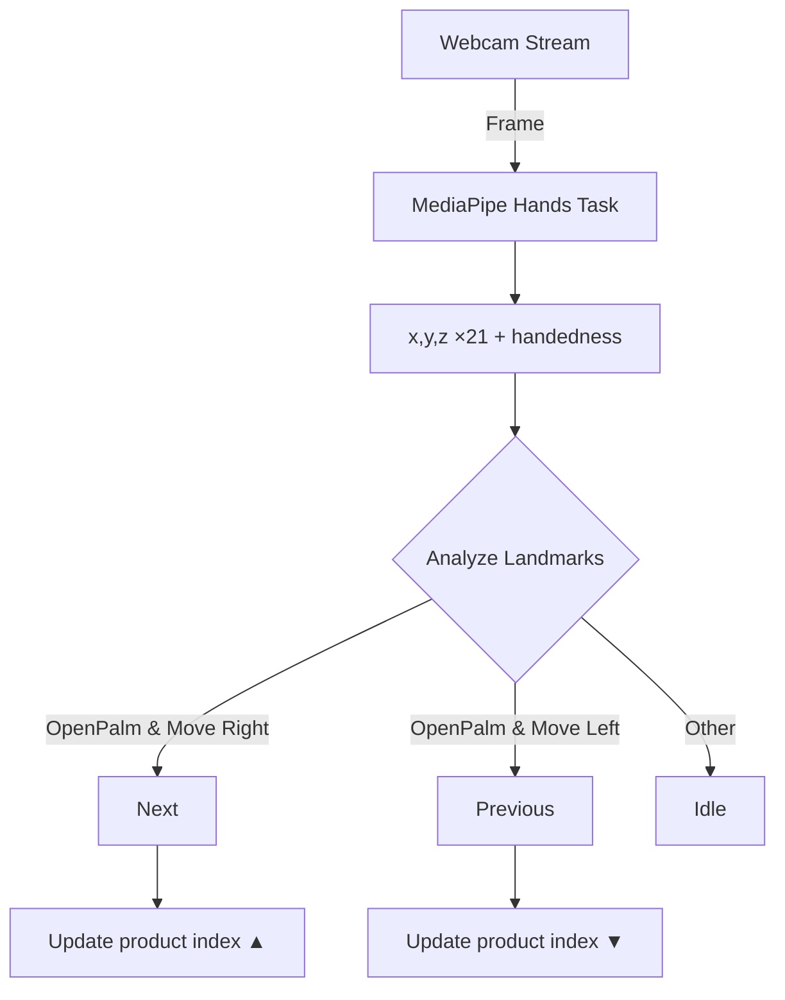

# Executive Summary  
MediaPipe offers robust hand-tracking and gesture-recognition solutions that detect **21 hand landmarks** and classify common gestures.  The built-in Gesture Recognizer (“canned” model) recognizes 7 dynamic hand shapes—**Closed_Fist, Open_Palm, Pointing_Up, Thumb_Down, Thumb_Up, Victory, ILoveYou** (plus “None” when unrecognized).  Each classification comes with a confidence score (0–1) alongside detailed 3D landmarks and handedness (left/right).  For swapping products in a web app, a **wave-like lateral swipe** (open palm moving left/right) is most intuitive, though MediaPipe has no built-in “wave” class.  Instead one can either use an existing static gesture (e.g. alternating *Open_Palm*) with motion logic or train a custom model.  Below we discuss the trade-offs and present a sample Next.js implementation using MediaPipe Hands (landmarks) plus custom logic to detect a horizontal wave motion.  We cover architecture, performance (using WebAssembly/WebGL, resolution tuning), UX/debounce, accessibility, cross-browser/mobile support, latency, and testing.  Links to official docs, demos, NPM packages, and GitHub resources are provided throughout.  

# MediaPipe Hand Tracking & Gesture Overview  

| **Detector / Output**     | **Type**         | **Recognized Gestures**                             | **Confidence Metrics**                          | **Live Demo / Examples**                               |
|---------------------------|------------------|-----------------------------------------------------|-----------------------------------------------|--------------------------------------------------------|
| **Hand Landmarks**        | 21-keypoint (x,y,z) per hand (via **MediaPipe Hands/HandLandmarker**)<sup>†</sup> | *None (landmarks only)* – enables custom gestures via landmarks | Detection/Tracking confidence (0.0–1.0 thresholds for palm detection, hand presence, tracking); no direct gesture score. | [MediaPipe Hand Landmarker Demo](https://google-ai-edge.github.io/mediapipe-samples-web/#/vision/hand_landmarker)<br>Official [MediaPipe Hands demo](https://mediapipe.dev/) |
| **Gesture Recognizer (Canned Model)** | Classification + Landmarks (via **MediaPipe Gesture Recognizer** task) | **Closed_Fist**, **Open_Palm**, **Pointing_Up**, **Thumb_Down**, **Thumb_Up**, **Victory**, **ILoveYou** (plus “None” if unrecognized) | Classification confidence score (0.0–1.0) per category; same palm-detection confidence thresholds as above. | [MediaPipe Gesture Recognizer Demo](https://google-ai-edge.github.io/mediapipe-samples-web/#/vision/gesture_recognizer)<br>Google AI Edge Gesture Recognizer web example |
| **Custom Models**<br>(MediaPipe Tasks)** | User-trained classifier on MediaPipe landmarks | Any user-defined gestures (e.g. “wave” as custom class) | Depends on model: provides classification score output for each custom label. | [Gesture Recognizer customization guide](https://developers.google.com/edge/mediapipe/solutions/vision/gesture_recognizer/custom) |

<sup>†</sup> *Hand Landmarks are produced by MediaPipe Hands/HandLandmarker.  There are 21 3D keypoints (wrist + 4 per finger). Landmarks are the basis for any gesture logic (e.g. comparing angles or movement).  The MediaPipe Hand Landmarker outputs landmarks and handedness for each detected hand.*

# Table: MediaPipe Hand Gestures & Outputs

| **Gesture / Output** | **Description** | **Detection Type**   | **Confidence**      | **Demo / Reference**                                            |
|----------------------|-----------------|----------------------|---------------------|------------------------------------------------------------------|
| *Hand Landmarks*     | 21-point hand skeleton (x,y,z per point) | Keypoint detection | No classification score; uses *min_detection_confidence* and *min_tracking_confidence* thresholds. | [Hand Landmarker Demo](https://google-ai-edge.github.io/mediapipe-samples-web/#/vision/hand_landmarker) |
| **Closed_Fist**      | Fingers curled into palm | Classification (gesture recognizer) | Score ~0–1 for “Closed_Fist” | MediaPipe sample code shows “Closed_Fist” label |
| **Open_Palm**        | All fingers extended, palm facing camera | Classification | Score for “Open_Palm” | Official docs list “Open_Palm” |
| **Pointing_Up**      | Index finger extended upward, others folded | Classification | Score for “Pointing_Up” | Listed as built-in gesture |
| **Thumbs_Up**        | Thumb up, other fingers closed | Classification | Score for “Thumb_Up” | Shown in example output (Thumb_Up, score 0.77) |
| **Thumbs_Down**      | Thumb down, other fingers closed | Classification | Score for “Thumb_Down” | Built-in gesture |
| **Victory (V sign)** | Index & middle fingers extended (V sign) | Classification | Score for “Victory” | Listed built-in gesture |
| **I Love You (ILoveYou)** | Thumb, index, pinky extended (ASL “I love you”) | Classification | Score for “ILoveYou” | Built-in gesture |
| **Unknown/None**     | No recognized gesture detected | Classification (fallback) | Often output as “None” label with low scores | Appears in canned classifier label list |

Each classification result includes a **confidence score** (0–1); for example, an output might report `"Thumb_Up" (score: 0.77)`.  The Hand Landmarker also reports *handedness* (e.g. “Left”/“Right” with a score) and 21 normalized (x,y,z) coordinates.  Landmark coordinates are normalized [0,1] relative to the image.  (The `z` value is depth in roughly meters.)

The above gestures are from MediaPipe’s pre-trained model.  If these do not cover your use-case (e.g. dynamic motions like waving side-to-side), you can either analyze **landmark movement over time** or train a *custom gesture model* using MediaPipe’s Task APIs.  Google’s documentation notes that MediaPipe can output landmarks and “hand gesture categories of multiple hands”, and offers customization for gesture recognizer models.

# Recommended Gesture(s) for Product-Swapping  

For horizontal product-swapping, an *actual waving motion* (open palm moving left/right) is most natural. However, MediaPipe’s canned gestures are *static* and do not include a “wave” category. Possible approaches:

- **Custom “Wave” Detection (Using Landmarks):**  Use MediaPipe Hands to track the hand’s landmarks each frame, then detect lateral oscillation of a visible open palm. For example, compute the wrist’s X-coordinate over time: if it moves left→right beyond a threshold (or vice versa), count that as a wave swipe. You’d first check that an open palm is detected (e.g. using landmark angles to ensure fingers are extended), then monitor horizontal movement.  *Trade-off:* More complex (need temporal analysis) and may be sensitive to noise or require smoothing (use a sliding window or velocity threshold). It can feel more “magic” to users but risks false positives if the camera shakes. Debouncing and inertia thresholds are critical.

- **Use Built-in Static Gesture + Motion Cue:**  For example, require the user to hold an **Open_Palm** or **Pointing_Up** gesture and then move it rightward to trigger a *Next*.  This simplifies to two steps (gesture + motion).  It may feel less intuitive but leverages MediaPipe’s classification of static poses.  For instance, an open palm appearing and then translating to the right could increment the product index. *Trade-off:* More deliberate (two-step), but less ambient switching, and can reuse confidence of detected “open palm” to validate gesture intent.

- **Alternate Static Gestures:**  Alternatively, use two different static gestures for Next/Previous (e.g. **Thumb_Up** = Next, **Thumb_Down** = Previous). These are reliably recognized out-of-the-box. *Trade-off:* Less intuitive for “swipe”, and users must remember gesture mapping.  Also not truly a “wave”.

**Rationale/Trade-offs:**  If “wave” is a strict requirement, custom logic is needed.  For reliability and ease, using a static gesture (like Open_Palm) as a precondition avoids misfires.  However, dynamic gestures (like waving or swiping) often feel more natural for pagination.  We recommend implementing an **open-palm swipe**: detect an open palm (high confidence), then watch its motion (e.g. track wrist x-velocity). Debounce triggers (see later) to avoid multiple swaps per gesture.  

*Example:* on detecting `Open_Palm` with confidence >0.8 and horizontal wrist displacement >30 pixels, trigger a swap. If motion <0, go previous; if >0, go next.  Alternatively, accumulate X-velocity and trigger on threshold. These details depend on UX testing.

# Next.js Implementation Example  

Below is a simplified example of integrating MediaPipe Hand Landmark detection into a Next.js React component to implement wave detection. It assumes a modern Next.js setup (e.g. Next 12+ with functional components and hooks). 

1. **Setup NPM Packages:**  
   ```bash
   npm install @mediapipe/hands @mediapipe/camera_utils @mediapipe/drawing_utils
   ```
   (Or use the [MediaPipe Tasks package](https://www.npmjs.com/package/@mediapipe/tasks-vision) for the Gesture Recognizer: `npm install @mediapipe/tasks-vision`. The example below uses the classic `@mediapipe/hands` API for landmarks.)

2. **React Component (e.g. `pages/index.js` or in `app/` directory):**  
   ```jsx
   import { useRef, useEffect, useState } from 'react';
   import { Hands } from '@mediapipe/hands';
   import { Camera } from '@mediapipe/camera_utils';

   export default function HandGestureSwapper() {
     const videoRef = useRef(null);
     const canvasRef = useRef(null);
     const [currentProduct, setCurrentProduct] = useState(0);
     const [gestureLock, setGestureLock] = useState(false); // debouncing flag
     // Example product list:
     const products = ['Product 1', 'Product 2', 'Product 3'];

     useEffect(() => {
       if (!videoRef.current) return;
       const hands = new Hands({
         locateFile: (file) => `https://cdn.jsdelivr.net/npm/@mediapipe/hands/${file}`
       });
       hands.setOptions({
         maxNumHands: 1,
         modelComplexity: 1,
         minDetectionConfidence: 0.6,
         minTrackingConfidence: 0.5
       });
       hands.onResults(onResults);

       const camera = new Camera(videoRef.current, {
         onFrame: async () => {
           await hands.send({image: videoRef.current});
         },
         width: 640,
         height: 480
       });
       camera.start();

       function onResults(results) {
         if (!results.multiHandLandmarks) return;
         // For simplicity, use first hand:
         const landmarks = results.multiHandLandmarks[0];
         handleGesture(landmarks);
         drawLandmarks(landmarks, canvasRef.current);
       }

       return () => {
         // Cleanup if component unmounts:
         camera.stop();
         hands.close();
       };
     }, [videoRef]);

     // Gesture detection logic (open palm swipe):
     const lastX = useRef(null);
     const lastTime = useRef(Date.now());
     function handleGesture(landmarks) {
       // Example: consider landmarks[0] = wrist, [5]=index base, [17]=pinky base.
       const wristX = landmarks[0].x;
       // Check open palm: distance between index base and pinky base relatively wide:
       const palmWidth = Math.hypot(
         (landmarks[17].x - landmarks[5].x),
         (landmarks[17].y - landmarks[5].y)
       );
       const isOpen = palmWidth > 0.1; // threshold; adjust via testing
       if (!isOpen) return; // require open palm to consider swipe

       // Compute horizontal velocity:
       const now = Date.now();
       if (lastX.current !== null && !gestureLock) {
         const dx = wristX - lastX.current;
         const dt = (now - lastTime.current) / 1000; // seconds
         const vx = dx / dt; // normalized units/sec
         const speed = Math.abs(vx);
         if (speed > 1.0) { // threshold velocity
           if (vx > 0) {
             setCurrentProduct((idx) => (idx + 1) % products.length);
           } else {
             setCurrentProduct((idx) => (idx - 1 + products.length) % products.length);
           }
           // Debounce: ignore until palm position resets
           setGestureLock(true);
           setTimeout(() => setGestureLock(false), 1000);
         }
       }
       lastX.current = wristX;
       lastTime.current = now;
       // Release lock if hand is relatively still:
       if (!isOpen) {
         setGestureLock(false);
       }
     }

     function drawLandmarks(landmarks, canvas) {
       const ctx = canvas.getContext('2d');
       ctx.save();
       ctx.clearRect(0, 0, canvas.width, canvas.height);
       // Mirror canvas as needed for user view:
       ctx.scale(-1, 1);
       ctx.drawImage(videoRef.current, -canvas.width, 0, canvas.width, canvas.height);
       ctx.scale(-1, 1);
       // Draw circles on landmarks:
       for (const lm of landmarks) {
         ctx.beginPath();
         ctx.arc(canvas.width * (1 - lm.x), lm.y * canvas.height, 5, 0, 2 * Math.PI);
         ctx.fillStyle = 'red';
         ctx.fill();
       }
       ctx.restore();
     }

     return (
       <div style={{ textAlign: 'center' }}>
         <h2>Current Product: {products[currentProduct]}</h2>
         <video ref={videoRef} style={{ display: 'none' }} />
         <canvas ref={canvasRef} width="640px" height="480px" />
         <p>Wave your open hand left/right to swap products.</p>
       </div>
     );
   }
   ```
   - **Explanation:** We use MediaPipe’s `Hands` API to process each video frame and output landmarks.  In `onResults`, we call `handleGesture(landmarks)`.  The `handleGesture` function checks for an open palm (approximate by palm width) and calculates horizontal wrist velocity.  If the velocity exceeds a threshold, it triggers `setCurrentProduct` to next/previous.  A `gestureLock` flag and `setTimeout` implement a **debounce** (~1 second) so a single wave triggers only once.  The landmarks are also drawn on a `<canvas>` for feedback (using simple red dots).  
   - **Architecture:** The component uses *hook refs* (`useRef`) to hold the video and canvas elements, and *state hooks* (`useState`) for current product and a debounce lock.  MediaPipe is run on each frame via `Camera` util, which handles `getUserMedia` under the hood.  We mirror the video in the canvas so the user sees a front-facing view.  (In production, you might flip horizontally for a mirror effect.)
   - **Performance:** We set `modelComplexity=1` and limit `maxNumHands=1` for speed.  Lower `minDetectionConfidence` can reduce frame rate if too low; tune as needed.  Using a 640×480 feed at ~30 FPS is reasonable for modern browsers.  
   - **Notes:** For production, handle component lifecycle (e.g. stop camera on unmount) and check browser API support.  Also, consider encapsulating the gesture logic into a separate hook or module for testability.  

3. **Supporting APIs / Routes:**  
   This example is entirely client-side.  You may add Next.js API routes if you need server-side logic (e.g. to log gesture events, fetch product data, etc.), but none are strictly needed for on-camera processing.

4. **Sample CSS (inline above):**  
   We simply center the canvas and hide the raw `<video>` element.  In a real app, you’d include ARIA labels (see *Accessibility* below) and possibly visual cues (e.g. overlay arrows).  

5. **NPM Packages & Repos:**  
   - [`@mediapipe/hands`](https://www.npmjs.com/package/@mediapipe/hands) – JavaScript binding for MediaPipe Hands (landmarks).  
   - [`@mediapipe/camera_utils`](https://www.npmjs.com/package/@mediapipe/camera_utils) – Simplifies webcam capture.  
   - [`@mediapipe/drawing_utils`](https://www.npmjs.com/package/@mediapipe/drawing_utils) – Utility for drawing landmarks (we rolled our own above).  
   - [`@mediapipe/tasks-vision`](https://www.npmjs.com/package/@mediapipe/tasks-vision) – (Optional) Unified tasks API including Gesture Recognizer.  
   - **GitHub:** 
     - [google-ai-edge/mediapipe-samples-web](https://github.com/google-ai-edge/mediapipe-samples-web) – official browser examples (including gesture-recognizer.ts).  
     - [google-ai-edge/mediapipe](https://github.com/google-ai-edge/mediapipe) – main MediaPipe repository.  
     - Community example: [lysdexic-audio/jweb-hands-gesture-recognizer](https://github.com/lysdexic-audio/jweb-hands-gesture-recognizer) – JS example listing the 7 gestures (see “Features” list).  
     - There are React wrappers (e.g. `react-mediapipe-hands`) but core Web APIs suffice.  

# UX & Accessibility Considerations  

- **User Feedback:** Show on-screen cues when a gesture is recognized (e.g. highlight the open palm or show an arrow).  Display the selected product name/number prominently.  Allow fallback controls (buttons or keyboard) in case gestures fail.  
- **Accessibility (ARIA):** Provide descriptive alt-text or ARIA live regions. For example, announce “Switched to Product 2” after a gesture. Ensure the app is still navigable via keyboard for non-camera users.  
- **Lighting/Background:** Advise the user to use gestures in view of the camera with adequate lighting and uncluttered background to improve detection accuracy.  
- **Latency:** Process at ~15–30 FPS if possible. Debouncing (as shown) prevents jitter from rapid gesture fluctuations. Use `requestAnimationFrame` (via `Camera` util) for smooth updates. The MediaPipe hands model on WASM+WebGL typically runs at ~30 fps on a modern laptop browser.  
- **Cross-Browser/Mobile:** MediaPipe Hands works on Chrome, Edge, Firefox on desktop, and some mobile browsers (Android Chrome). (iOS Safari may not support `getUserMedia` or WASM performance as well, so consider a fallback UI.)  Test on each target device.  
- **Permission Fallback:** If camera access is denied, catch the error (from `navigator.mediaDevices.getUserMedia()`) and display an overlay: e.g. “Camera access needed for gestures. Click here to retry or use buttons.” A helpful message is essential. For privacy, mention processing is done **on-device only** (no video is sent anywhere).  
- **Debounce and Rate-Limit:** As shown, after a swap action, ignore further gestures for ~1 second to avoid multiple triggers.  Alternatively, require the user to “reset” hand position (e.g. close fist or remove hand) before next gesture.  



# Testing Checklist & Examples  

1. **Unit Tests (e.g. with Jest):**  
   - Test gesture-detection logic functions in isolation. For instance, if you factor out a function that computes swipe direction from a sequence of wrist-X values, write a test feeding sample data and assert it triggers Next/Previous appropriately.  
   - Example snippet:  
     ```js
     // gestureUtils.js
     export function detectSwipeDirection(xs, timeIntervals) {
       // returns "left", "right", or null
       // (implementation similar to handleGesture above)
     }
     ```
     ```js
     // gestureUtils.test.js
     import { detectSwipeDirection } from './gestureUtils';
     test('detectSwipeDirection rightward', () => {
       const xs = [0.4, 0.5, 0.6]; // normalized wrist x increasing
       const dt = [100, 100];
       expect(detectSwipeDirection(xs, dt)).toBe('right');
     });
     test('detectSwipeDirection none for slow movement', () => {
       const xs = [0.4, 0.41, 0.42];
       const dt = [100, 100];
       expect(detectSwipeDirection(xs, dt)).toBe(null);
     });
     ```
   - Test debouncing logic: ensure repeated calls within lock time don’t trigger extra events.

2. **Integration Tests:**  
   - Simulate DOM/video: Hard to do pure unit; you can mock `navigator.mediaDevices.getUserMedia` and the Canvas API.  Tools like [jest-canvas-mock](https://github.com/hustcc/jest-canvas-mock) can stub canvas. Use React Testing Library to render the component and simulate `onResults` calls.  
   - Example (pseudo-code):  
     ```jsx
     // Using React Testing Library and jest.mock
     test('swaps product on gesture', () => {
       // Render component
       const { getByText } = render(<HandGestureSwapper />);
       // Mock results: call the internal handleGesture with synthetic landmarks
       act(() => {
         // e.g. dispatch a swipe event programmatically
       });
       expect(getByText(/Product 2/)).toBeInTheDocument();
     });
     ```

3. **E2E Tests (Cypress/Puppeteer):**  
   - Launch the app in a browser and simulate camera stream (e.g. use a prerecorded webcam video file). Test the visual output or state change. This is advanced but possible with headless tools.

4. **Performance/Load Tests:**  
   - Measure FPS and CPU usage during normal use. Use browser dev tools for performance profiling. Ensure UI remains responsive even if camera/mL is heavy.

# Performance Tuning & Fallback Strategies  

- **Model Complexity:** Use a lighter model if needed (`modelComplexity: 0` for faster inference with lower accuracy).  
- **Image Size:** Lower video resolution (e.g. 640×480) to speed up processing; downscale input frames.  
- **WebAssembly / GPU:** MediaPipe uses WebAssembly and (on supported browsers) WebGL backends. Keep browsers up-to-date. No explicit GPU enable flag on web, but using `<script>` via CDN (as above) leverages WASM.  
- **Threading:** The built-in camera utils and WASM run on the main thread; ensure heavy logic (if any) is minimal. Avoid expensive operations in `onResults`.  
- **Lazy Loading:** Only initialize MediaPipe when needed (e.g. after permission granted) to reduce cold-start delay.  
- **Fallback (No Camera):** Show a fallback UI (e.g. “Camera unavailable – use left/right buttons”) if `getUserMedia` fails or if user selects “no camera”. Ensure core app functionality (swapping products) is still accessible via non-gesture controls.

```mermaid
stateDiagram
    [*] --> Idle
    Idle --> "Detecting OpenPalm"
    "Detecting OpenPalm" --> "Swipe Right" : if vx>threshold
    "Detecting OpenPalm" --> "Swipe Left"  : if vx<-threshold
    "Swipe Right" --> Debounce : trigger NextProduct
    "Swipe Left" --> Debounce  : trigger PrevProduct
    Debounce --> Idle : after 1s delay
```

# References  
- MediaPipe Hands (Landmark) overview – 21 3D landmarks per hand.  
- MediaPipe Gesture Recognizer (Canned) details – categories, outputs.  
- Google AI Edge docs and demos for Hand Landmarker and Gesture Recognizer.  
- Official sample code and GitHub (e.g. [`mediapipe-samples-web`](https://github.com/google-ai-edge/mediapipe-samples-web)).  
- NPM packages: `@mediapipe/tasks-vision` (Gesture Recognizer), `@mediapipe/hands` (landmarks).  

Each source above provides in-depth detail on the models, outputs, and example usage. All processing is on-device (no cloud calls). This guide combines those resources to deliver a complete Next.js implementation with gesture-based product swapping.  

